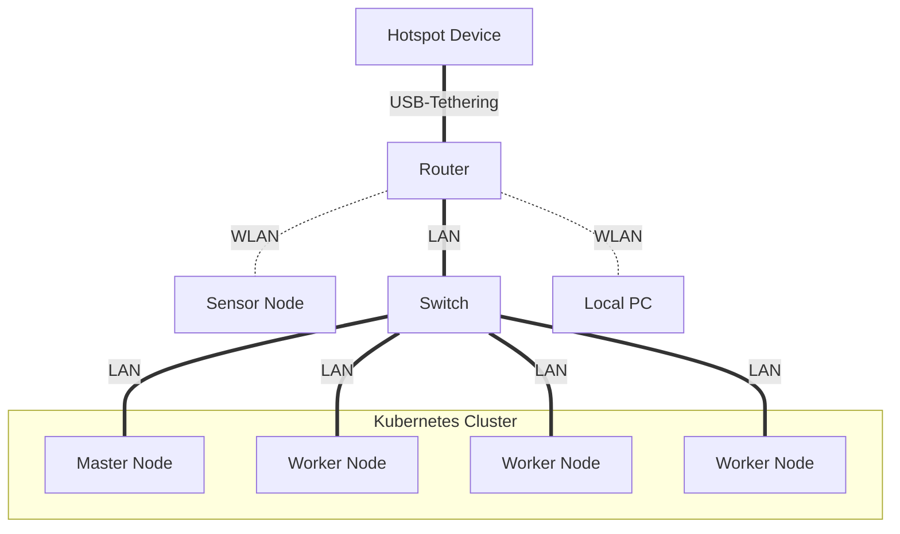
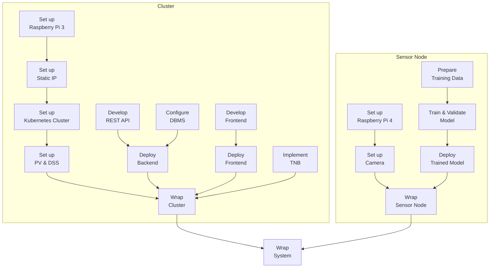

TODO: Table of contents

# Overview

**Introduction**: The project *Automatic Pet Detection With Edge Computing* is part of the Cloud Computing SS23 module of Prof. Dr. Christian Baun at the Frankfurt University of Applied Sciences. Further information about the module can be found [here](https://www.christianbaun.de/CGC23/index.html).

**Objective**: This project aims to develop an edge computing solution for the automatic detection of cats and dogs. General steps to achieve the project goal are listed in the **Project Plan** part of this Overview section.

**Duration**: 12.04.2023 - 05.07.2023

**Source Code**: [Link](https://github.com/ccfrauasgr2/pet-detection/tree/main)

**Presentation Slides**: [Link](https://docs.google.com/presentation/d/1wE96Q1euAeaRYBAPP1TrVFQCkrlQES2NmLTt2wVjyIs/edit?usp=sharing)

**Hardware**:

Received from Prof.:

- 1x Raspberry Pi 4 Model B
- 4x Raspberry Pi 3 Model B+
- 5x Samsung EVO Plus 32GB MicroSDHC
- 1x Apple USB-C-to-USB-C Charger
- 1x Anker 6-Port PowerPort
- 2x TP-Link TL-SG105 5-Port Desktop Switch
- 6x LAN Cable
- 4x CoolReal USB-C-to-USB-C Cable
- 1x Raspberry Pi Camera Module 2

Obtained from own source:

- 1x FRITZ!Box 3272 Router
- 1x USB-to-USB-C Cable

**Network Architecture**:



**System Architecture**:


| Component                              | Role                                                                                                                                                                                |
| -------------------------------------- | ----------------------------------------------------------------------------------------------------------------------------------------------------------------------------------- |
| Camera                                 | captures visual data and sends them to the sensor node                                                                                                                              |
| Detection Model                        | analyzes visual data to detect and classify pet                                                                                                                                     |
| Persistent Volume (PV)                 | serves as the shared persistent storage resource in the cluster                                                                                                                     |
| Distributed Storage System (DSS)       | manages the underlying storage infrastructure of the persistent volume, allows concurrent read and write operations to the shared persistent volume, ensures high data availability |
| Frontend Pod+                          | provides user interface and handles user interactions, scalable                                                                                                                     |
| REST API Pod+                          | exposes endpoints to facilitate communication and data exchange between system components, scalable                                                                                 |
| Database Management System (DBMS) Pod+ | handles write and read queries for storing and retrieving detection results, scalable                                                                                               |
| Telegram Notification Bot (TNB)        | notifies user about detection results via Telegram                                                                                                                                  |


**System Behavior**:

TODO: Text description
> **_IDEA:_**
> - Live detection
> - Detect phase starts when the model detects pet for the first time (since the beginning of live detection OR after the previous detect phase ends).
> - Detect phase ends when the model no longer detects pet.
> - Telegram notifications are sent at the beginning and at the end of each detect phase.
> - The first detection result (successful pet detection) is sent right away to the cluster for Telegram notification.
> - Beside the first detection result, only subsequent detection results at 2- or 3-second intervals until the detect phase ends are sent to the cluster.
> - These detection results should be sent in batches to reduce overhead and improve efficiency. 
> - This process can be realized by using the REST API and a buffer in the sensor node: If the buffer reaches a certain size or timer, the detection results are sent to the REST API in the sensor node in batches. When the detect phase ends, any remaining results in the buffer are also sent to the REST API in the sensor node in batches.
> - The REST API containers in the cluster receive the detection results and store them in the persistent volume.
> - The frontend containers on the worker nodes periodically query the REST API containers for any new detected pets and display them.

Telegram message when detect phase starts:

`A wild Pikachu appeared!` (LOL - Just kidding)

`<ANIMAL_TYPES> detected at <START_TIME> on <DATE>`

`<PHOTO_WITH_BOUNDING_BOXES_&_ANIMAL_TYPES_&_CONF_VALUE>`

Telegram message when detect phase ends: 

`In <DURATION> seconds from <START_TIME> to <END_TIME> on <DATE>: <ANIMAL_TYPEs> were detected, X pictures were taken, and the highest confidence value is <HIGHEST_CONF_VALUE> `


**Project Plan**:


**Group 2 Info & Task Distribution**:

| Member              | MatrNr. | Uni-Mail                            | Tasks                                                                                                       |
| ------------------- | ------- | ----------------------------------- | ----------------------------------------------------------------------------------------------------------- |
| Vincent Roßknecht   | 1471764 | vincent.rossknecht@stud.fra-uas.de  | Prepare Training Data<br/>Train & Validate Model                                                            |
| Jonas Hülsmann      | 1482889 | jonas.huelsman@stud.fra-uas.de      | Set up Raspberry 3<br/>Set up Kubernetes Cluster<br/>Develop REST API<br/>Implement TNB                     |
| Marco Tenderra      | 1251463 | tenderra@stud.fra-uas.de            | Set up Raspberry 4<br/>Set up Camera<br/>Prepare Training Data<br/>Develop REST API                         |
| Minh Kien Nguyen    | 1434361 | minh.nguyen4@stud.fra-uas.de        | Set up Raspberry 3<br/>Set up Static IP<br/>Set up Kubernetes Cluster<br/>Set up PV & DSS<br/>Implement TNB |
| Alexander Atanassov | 1221846 | alexander.atanassov@stud.fra-uas.de | Develop Frontend<br/>Develop REST API                                                                       |


# Sensor Node

## Set up Raspberry Pi 4
- Insert an empty SD-Card into local PC.
- Install then run [Raspberry Pi Imager](https://www.raspberrypi.com/software/) on local PC.
- In the Raspberry Pi Imager:
  - For Operating System, select `Raspberry Pi OS Lite (32-bit)`.
  - For Storage, select the inserted SD-Card.
  - In Advanced options (Cog icon):
    - Set `pi0` as hostname.
    - Set `admin` as username and set own password.
    - Enable `Enable SSH` and `Use password authentication` options. This allows for remote access and control of Raspberry Pi 4 via SSH from local PC. 
    - Enable `Configure wireless LAN` option, type in the SSID and password of the router so that Raspberry Pi 4 will automatically connect to the router network. For more information see [Set up Static IP](#set-up-static-ip).
    - To save the above advance options for further use, set Image customization options to `to always use`.
  - Write to SD-Card.
- [Connect](https://projects.raspberrypi.org/en/projects/raspberry-pi-setting-up/3) and [Start up](https://projects.raspberrypi.org/en/projects/raspberry-pi-setting-up/4) Raspberry Pi 4 with SD-Card.
- [SSH into Raspberry Pi](https://www.makeuseof.com/how-to-ssh-into-raspberry-pi-remote/#:~:text=SSH%20Into%20Raspberry%20Pi%20From%20Windows&text=In%20the%20PuTTY%20dialog%2C%20select,the%20connection%20details%20in%20PuTTY.) 4 from local PC with the command `ssh admin@pi0.local`
- Update system packages with `sudo apt update` then `sudo apt upgrade -y`  
- SSH only provides *terminal* access to Raspberry Pi 4. To *remotely control the desktop interface* of Raspberry Pi 4, we use VNC (Virtual Network Computing). To enable VNC connection:
  - First, enable VNC Server on Raspberry Pi 4. SSH into Raspberry Pi 4 from local PC, then enter `sudo raspi-config`. Now with the arrows select `Interfacing Options`, navigate to `VNC`, choose `Yes`, and select `Ok`.
  - Install [Real VNC Viewer](https://www.realvnc.com/en/connect/download/viewer/) on local PC.
  - Open local VNC Viewer, enter `pi0.local:0` or `[IP address of Raspberry Pi 4]`. To find the IP address of Raspberry Pi 4, SSH into Raspberry Pi 4 from local PC, then enter `hostname -I`.
  - Enter login credentials that were set while configuring Raspberry Pi Imager.
  - The VNC session should start, and the Raspberry Pi desktop should be available.

## Set up Camera

- To connect Raspberry Pi Camera Module 2 to Raspberry Pi 4, follow the steps listed in [Connect the Camera Module](https://projects.raspberrypi.org/en/projects/getting-started-with-picamera/2). Make sure the Camera Module faces the USB and Ethernet ports.
- To test if the connection is working, enter `libcamera-still -o test.jpg` to capture a single image. For more information about `libcamera-still`, refer to [this documentation](https://www.raspberrypi.com/documentation/computers/camera_software.html#libcamera-and-libcamera-apps).

## Prepare Training Data

## Train & Validate Model

## Deploy Trained Model

## Wrap Sensor Node

# Cluster

## Set up Raspberry Pi 3

- Follow the steps listed in [Set up Raspberry Pi 4](#set-up-raspberry-pi-4), but disable `Configure wireless LAN` option.
- For Operating System, select `Raspberry Pi OS Lite (64-bit)`.
- Set `pi[1|2|3|4]` as hostname for each of four available Raspberry Pi 3.
- **DO NOT SSH into each Raspberry Pi 3 yet!** Do that after [Set up Static IP](#set-up-static-ip) is done.

## Set up Static IP

Given [the hardware specifications of the four Raspberry Pi 3](https://www.raspberrypi.com/products/raspberry-pi-3-model-b-plus/), it is best to set them up as a Kubernetes cluster with [`k3s`](https://docs.k3s.io/) - a lightweight Kubernetes distribution suitable for edge computing. One Raspberry Pi 3 (`pi1`) will be used as master node, while the other three (`pi2, pi3, pi4`) will be used as worker nodes. For more information about the design of the Kubernetes cluster, see [Set up Kubernetes Cluster](#set-up-kubernetes-cluster).

For a `k3s` Kubernetes cluster to work, the worker nodes must know the IP address of the master node, so that they can communicate with each other. However, if the master node is directly connected to a hotspot, then whenever the gateway IP of the hotspot changes, the master node will receive from the hotspot an IP address different from the one registered on the worker nodes. Consequently, the master node and the worker nodes cannot communicate with each other, i.e., the Kubernetes won't work (in that case, when entering the command `kubectl get nodes` on the master node, the worker nodes will be shown as `Not Ready`).

Thus, it is critical that the master and worker nodes be assigned static (fixed) IP addresses, so that communication between them still holds even when the gateway IP address of the hotspot changes. To assign static IP addresses to the nodes, an additional FRITZ!Box Router is used. Here are the steps to set up static IP addresses:

- Turn on all hardware shown in the Network Architecture part of the [Overview section](#overview).
- Share the hotspot device's internet connection with the router through USB-Tethering.
- Connect local PC and all Raspberry Pi with the router's local network.
- On local PC, enter `ipconfig` on Command Prompt (in Windows) and look for the Default Gateway IP address of the router network, which is `192.168.178.1` for our router.
- Still on local PC, enter the IP address just found in a browser to open the router (FRITZ!Box) user interface (see below image; `KIEN-LEGION5` and `Google Pixel 5` were the local PC and hotspot device used, respectively).

  

- [Assign static IP addresses to all available Raspberry Pi](https://www.giga.de/hardware/avm-fritz-box-fon-wlan-7390/tipps/fritzbox-feste-ip-vergeben-so-geht-s/), then restart all Raspberry Pi.

  | Raspberry Pi | Assigned IP Address (WLAN) |
  | ------------ | -------------------------- |
  | ``pi1``      | `192.168.178.71`           |
  | ``pi2``      | `192.168.178.72`           |
  | ``pi3``      | `192.168.178.73`           |
  | ``pi4``      | `192.168.178.74`           |
- To check if the setup works, restart hotspot device, then turn hotspot on again. All Raspberry Pi should still have Internet access and the same static IP addresses assigned to them.
  
  
  


## Set up Kubernetes Cluster

As previously mentioned, the Kubernetes cluster consists of one Raspberry Pi 3 (`pi1`) designated as the master (server) node, and the remaining three Raspberry Pi 3 (`pi2, pi3, pi4`) serve as worker (agent) nodes. The main drawback of this design is the only master node, which is *the* single point of failure of the whole cluster. Thus, to ensure high availability of the cluster, it was also considered to use two Raspberry Pi 3 as master nodes and the other two as worker nodes. However, this design was discarded, because [performance issues exist on slower disks such as Raspberry Pis running with SD cards, and ``k3s`` requires three or more server nodes to run a multiple-server Kubernetes cluster](https://docs.k3s.io/datastore/ha-embedded).

To make setting up Kubernetes cluster and later PV & DSS easier, follow these steps first:

- [SSH into each Raspberry Pi 3](https://www.makeuseof.com/how-to-ssh-into-raspberry-pi-remote/#:~:text=SSH%20Into%20Raspberry%20Pi%20From%20Windows&text=In%20the%20PuTTY%20dialog%2C%20select,the%20connection%20details%20in%20PuTTY.) from local PC, then run `sudo apt update` and `sudo apt upgrade -y` to update their system packages. Also on each Raspberry Pi 3, run `sudo nano /boot/cmdline.txt` to open the file `/boot/cmdline.txt` and **append** `cgroup_memory=1 cgroup_enable=memory` at the end of the first line. **It is important that there is no line break added.** Hit `Ctrl` + `X` -> `Y` -> `Enter` to save changes.
- SSH into `pi1` from local PC, then add the block below to the `/etc/host` file with `sudo nano /etc/hosts`, hit `Ctrl` + `X` -> `Y` -> `Enter` to save changes. By having these entries in the `/etc/host` file, `pi1` is able to access other Raspberry Pi within local network by hostnames, simplifying network communication and identification.

  ```
  192.168.178.71 pi1 pi1.local

  192.168.178.72 pi2 pi2.local
  192.168.178.73 pi3 pi3.local
  192.168.178.74 pi4 pi4.local
  ```
- On `pi1`, use  `sudo apt install ansible` to install [Ansible](https://docs.ansible.com/) - a tool that allows us to define and execute tasks in an automated and repeatable manner, reducing the need for manual intervention and saving time and effort. In other words, Ansible simplifies the management of the Raspberry Pi as well as the Kubernetes cluster. The installation can be verified with `ansible --version`
- Next, create file `/etc/ansible/hosts` in `pi1`, then add the block below to the file with `sudo nano /etc/ansible/hosts`, hit `Ctrl` + `X` -> `Y` -> `Enter` to save changes. In essence, here we define hosts (nodes) and 3 groups of hosts that Ansible will try to manage: ``master``, ``workers`` and ``nodes``. This was split so that if we want to execute some actions only on a certain group, we use that group's name. Group `nodes` has children, which basically means that it’s a group of groups, and when we use `nodes` we target every single node from the listed groups. Variable `ansible_connection` of a host tells Ansible how to connect to that host. The primary method is ``ssh``, but ``local`` was specified for ``pi1``, because we run Ansible from this node. This way, `pi1` won’t try to SSH into itself.

  ```
  [master]
  pi1  ansible_connection=local

  [workers]
  pi2  ansible_connection=ssh
  pi3  ansible_connection=ssh
  pi4  ansible_connection=ssh

  [nodes:children]
  master
  workers
  ```
- After adding Ansible hosts, run the commands in the block below to enable logging in to other nodes from `pi1` using SSH key, so that there is no need to type the password every time running Ansible.

  ```
  # Make sure you are user <admin>
  # Go to <admin>'s home directory
  cd

  # Create directory ".ssh" in <admin>'s home directory
  mkdir -p ~/.ssh

  # Change permissions of the ".ssh" directory to "700"
  # "700" means that ONLY the owner of the directory (<admin>) has read, write, and execute permissions
  chmod 700 ~/.ssh

  # Generate SSH key
  # DO NOT fill anything when asked, just hit Enter
  ssh-keygen -t rsa

  # Copy keys to each node:
  ssh-copy-id -i ~/.ssh/id_rsa.pub admin@pi2
  ssh-copy-id -i ~/.ssh/id_rsa.pub admin@pi3
  ssh-copy-id -i ~/.ssh/id_rsa.pub admin@pi4
  ```
- On `pi1`, run `ansible nodes -m ping` to check if Ansible is working fine and can connect to all nodes. All nodes should show `SUCCESS` status. 
- Run `ansible nodes -b -m shell -a "reboot"` to reboot all nodes, so that all changes thus far can take place.


Here are the steps to set up a Kubernetes cluster with the four available Raspberry Pi 3:

- Run `curl -sfL https://get.k3s.io | sh -s - --disable servicelb --token CompNet123 --disable local-storage` to install `k3s server` on `pi1` (the designated master node).
  - ``--disable servicelb`` - Set this flag to disable the Service LoadBalancer of Kubernetes, since Kubernetes does not offer an implementation of network load balancers (Services of type LoadBalancer) for bare-metal clusters anyway. We will use [MetalLB](https://metallb.universe.tf/) instead.
  - ``--token`` - The token used by the worker nodes to connect to the master node, necessary for installing `k3s agent` on worker nodes. Here the token is set to `CompNet123`.
  - ``--disable local-storage`` - Set this flag to disable the k3s local storage. We will set up [Longhorn](https://longhorn.io/docs/1.4.2/what-is-longhorn/) storage provider instead. For more information see [Set up PV & DSS](#set-up-pv--dss).
- Still on `pi1`, run `ansible workers -b -m shell -a "curl -sfL https://get.k3s.io | K3S_URL=https://192.168.178.71:6443 K3S_TOKEN=CompNet123 sh -"` to install `k3s agent` on  `pi2, pi3, pi4` (the designated worker nodes).

## Set up PV & DSS

## Develop REST API

## Configure DBMS

## Deploy Backend

## Develop Frontend

## Deploy Frontend

## Implement TNB

## Wrap Cluster


