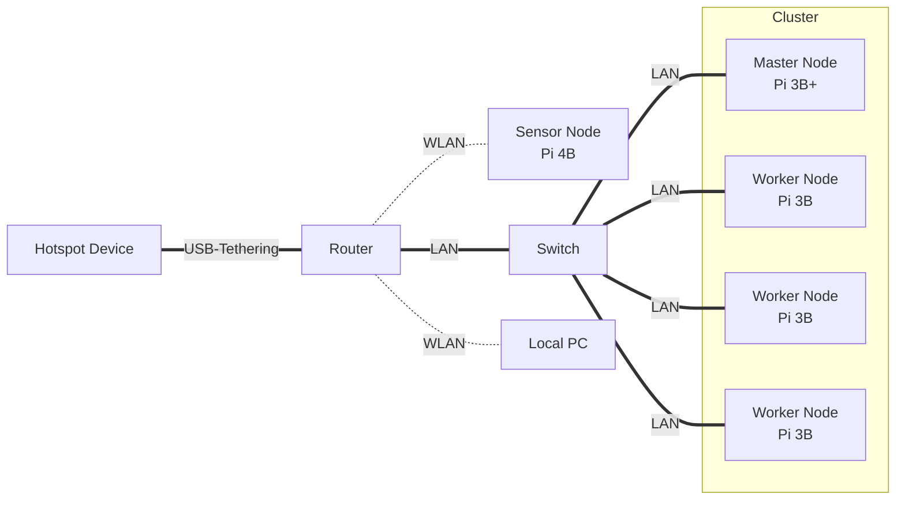
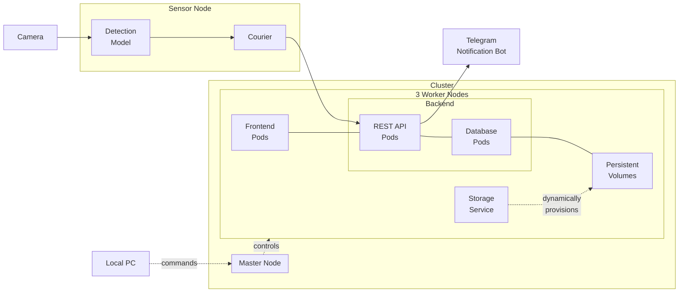
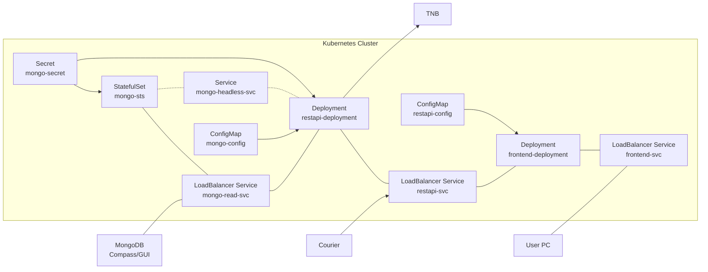
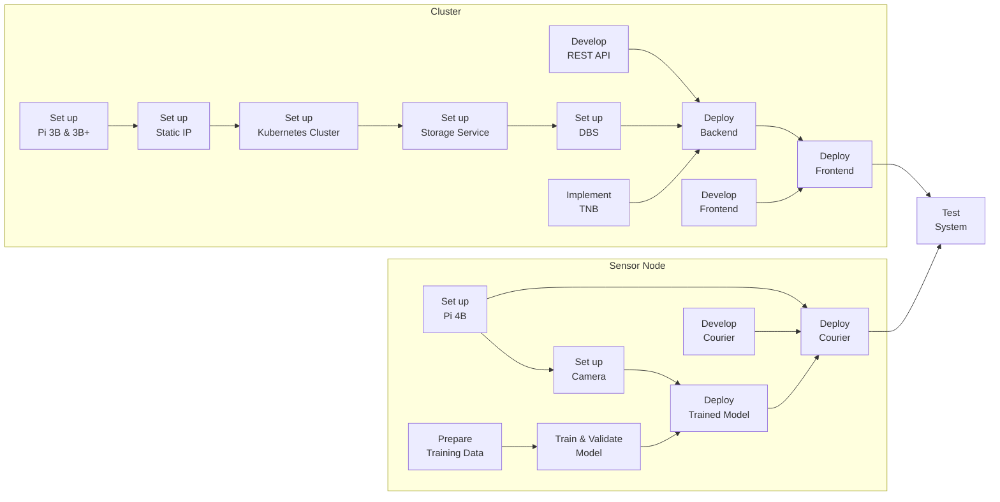

TODO: Table of contents

# Overview

**Introduction**: The project *Automatic Pet Detection With Edge Computing* is part of the Cloud Computing SS23 module of Prof. Dr. Christian Baun at the Frankfurt University of Applied Sciences. Further information about the module can be found [here](https://www.christianbaun.de/CGC23/index.html).

**Objective**: This project aims to develop an edge computing solution for the automatic detection of cats and dogs. General steps to achieve the project goal are listed in the **Project Plan** part of this Overview section.

**Duration**: 12.04.2023 - 05.07.2023

**Source Code**: [Link](https://github.com/ccfrauasgr2/pet-detection/tree/main)

**Presentation Slides**: [Link](https://docs.google.com/presentation/d/1wE96Q1euAeaRYBAPP1TrVFQCkrlQES2NmLTt2wVjyIs/edit?usp=sharing)

**Hardware**:

Received from Prof.:

- 1x Raspberry Pi 4 Model B (Pi 4B)
- 1x Raspberry Pi 3 Model B+ (Pi 3B+)
- 3x Raspberry Pi 3 Model B V1.2 (Pi 3B)
- 5x Samsung 32GB MicroSDHC
- 1x Apple USB-C-to-USB-C Charger
- 1x Anker 6-Port PowerPort
- 2x TP-Link TL-SG105 5-Port Desktop Switch
- 6x LAN Cable
- 4x CoolReal USB-C-to-USB-C Cable
- 1x Raspberry Pi Camera Module 2 (Camera Module)

Obtained from own source:

- 1x FRITZ!Box 3272 Router
- 1x USB-to-USB-C Cable
- 1x ISY ICR-120 8-in-1 Card Reader

**Network Architecture**:



**System Architecture**:



| Component                       | Role                                                                                                                                                                  |
| ------------------------------- | --------------------------------------------------------------------------------------------------------------------------------------------------------------------- |
| Camera                          | capture and send visual data to the sensor node                                                                                                                       |
| Detection Model                 | analyze visual data to detect & classify pet                                                                                                                          |
| Courier                         | send visual data and detection results to the cluster                                                                                                                 |
| Persistent Volumes (PV)         | - serve as persistent storage resource in the cluster<br>- use local storage available on worker nodes                                                                |
| Storage Service                 | - dynamically provision PV<br>- manage the underlying storage infrastructure of PV                                                                                    |
| Frontend Pods                   | - provide user interface<br>- handle user interactions                                                                                                                |
| REST API Pods                   | expose endpoints to facilitate communication & data exchange between system components                                                                                |
| Database (DBS) Pods             | - handle read & write queries for retrieving & storing detection results<br>- synchronize & replicate data across pods/worker nodes (Master-slave replication in DBS) |
| Telegram Notification Bot (TNB) | notify user about detection results via Telegram                                                                                                                      |
| Local PC                        | serve as tool for setting up system                                                                                                                                   |


**System Behavior**:

See [Test System](#test-system) section.

**Kubernetes Architecture:**



**Project Plan**:


**Group 2 Info & Task Distribution**:

| Member              | MatrNr. | Uni-Mail                            | Tasks                                                                                                                                                                                    |
| ------------------- | ------- | ----------------------------------- | ---------------------------------------------------------------------------------------------------------------------------------------------------------------------------------------- |
| Vincent Roßknecht   | 1471764 | vincent.rossknecht@stud.fra-uas.de  | - Prepare Training Data<br/>- Train & Validate Model<br/>- Test System                                                                                                                   |
| Jonas Hülsmann      | 1482889 | jonas.huelsman@stud.fra-uas.de      | - Develop REST API<br/>- Develop Frontend<br/>- Implement TNB<br/>- Deploy Backend<br/>- Develop Courier                                                                                 |
| Marco Tenderra      | 1251463 | tenderra@stud.fra-uas.de            | - Set up Pi 4B<br/>- Set up Camera<br/>- Prepare Training Data<br/>- Deploy Trained Model<br/>- Develop REST API<br/>- Develop Courier<br/>- Deploy Courier                              |
| Minh Kien Nguyen    | 1434361 | minh.nguyen4@stud.fra-uas.de        | - Set up Pi 3B & 3B+<br/>- Set up Static IP<br/>- Set up Kubernetes Cluster<br/>- Set up Storage Service<br/>- Set up DBS<br/>- Implement TNB<br/>- Deploy Backend<br/>- Deploy Frontend |
| Alexander Atanassov | 1221846 | alexander.atanassov@stud.fra-uas.de | - Develop REST API<br/>- Develop Frontend<br/>- Deploy Frontend                                                                                                                          |


# Sensor Node

## Set up Pi 4B
- Insert an empty SD-Card into local PC.
- Install then run [Raspberry Pi Imager](https://www.raspberrypi.com/software/) on local PC.
- In the Raspberry Pi Imager:
  - For Operating System, select `Raspberry Pi OS (64-bit)`.
  - For Storage, select the inserted SD-Card.
  - In Advanced options (Cog icon):
    - Set `pi0` as hostname.
    - Set `admin` as username and set own password.
    - Enable `Enable SSH` and `Use password authentication` options. This allows for remote access and control of Pi 4B via SSH from local PC. 
    - Enable `Configure wireless LAN` option, type in the SSID and password of the router so that Pi 4B will automatically connect to the router network.
    - To save the above advance options for further use, set Image customization options to `to always use`.
  - Write to SD-Card.
- [Connect](https://projects.raspberrypi.org/en/projects/raspberry-pi-setting-up/3) and [Start up](https://projects.raspberrypi.org/en/projects/raspberry-pi-setting-up/4) Pi 4B with SD-Card.
- [SSH into](https://www.makeuseof.com/how-to-ssh-into-raspberry-pi-remote/#:~:text=SSH%20Into%20Raspberry%20Pi%20From%20Windows&text=In%20the%20PuTTY%20dialog%2C%20select,the%20connection%20details%20in%20PuTTY.) Pi 4B from local PC with the command `ssh admin@pi0.local`
- Update system packages with `sudo apt update` then `sudo apt upgrade -y`  
- SSH only provides *terminal* access to Pi 4B. To *remotely control the desktop interface* of Pi 4B, we use VNC (Virtual Network Computing). To enable VNC connection:
  - First, enable VNC Server on Pi 4B. SSH into Pi 4B from local PC, then enter `sudo raspi-config`. Now with the arrows select `Interfacing Options`, navigate to `VNC`, choose `Yes`, and select `Ok`.
  - Install [Real VNC Viewer](https://www.realvnc.com/en/connect/download/viewer/) on local PC.
  - Open local VNC Viewer, enter `pi0.local:0` or `[IP address of Pi 4B]`. To find the IP address of Pi 4B, SSH into Pi 4B from local PC, then enter `hostname -I`.
  - Enter login credentials that were set while configuring Raspberry Pi Imager.
  - The VNC session should start, and the Raspberry Pi desktop should be available.

## Set up Camera

- To connect Camera Module to Pi 4B, follow the steps listed in [Connect the Camera Module](https://projects.raspberrypi.org/en/projects/getting-started-with-picamera/2). Make sure the Camera Module faces the USB and Ethernet ports.
- To test if the connection is working, enter `libcamera-still -o test.jpg` to capture a single image. For more information about `libcamera-still`, refer to [this documentation](https://www.raspberrypi.com/documentation/computers/camera_software.html#libcamera-and-libcamera-apps).

## Prepare Training Data

## Train & Validate Model

## Deploy Trained Model

## Develop Courier

## Deploy Courier

# Cluster

## Set up Pi 3B & 3B+

- Follow the steps listed in [Set up Pi 4B](#set-up-pi-4b), but disable `Configure wireless LAN` option, and **DO NOT SSH into each Pi 3 yet!**
- For Operating System, select `Raspberry Pi OS Lite (64-bit)`.
- Set `pi1` as hostname for Pi 3B+, and `pi2`, `pi3`, `pi4` as hostname for each of three available Pi 3B.

## Set up Static IP

For a Kubernetes cluster to work, the worker nodes must know the IP address of the master (controller) node and vice versa, so that they can communicate with each other. If the nodes' IP addresses change during communication, the Kubernetes cluster won't work. It is therefore critical that the master and worker nodes be assigned static (fixed) IP addresses. For that purpose, we use an additional FRITZ!Box Router. Here are the steps to set up static IP addresses:

- Turn on all hardware shown in the Network Architecture part of the [Overview section](#overview).
- Share the hotspot device's internet connection with the router through USB-Tethering.
- Connect local PC and all Pi with the router network.
- On local PC, enter `ipconfig` on Command Prompt (in Windows) and look for the Default Gateway IP address of the router network (`192.168.178.1` in our case).
- Still on local PC, enter the IP address just found in a browser to open the router (FRITZ!Box) user interface (see below image; `KIEN-LEGION5` and `Google Pixel 5` were the local PC and hotspot device used, respectively).

  

- [Assign static IP addresses to all available Pi](https://www.giga.de/hardware/avm-fritz-box-fon-wlan-7390/tipps/fritzbox-feste-ip-vergeben-so-geht-s/), then restart all Pi.

  | Raspberry Pi | Assigned IP Address | Connection |
  | ------------ | ------------------- | ---------- |
  | ``pi1``      | `192.168.178.61`    | LAN        |
  | ``pi2``      | `192.168.178.62`    | LAN        |
  | ``pi3``      | `192.168.178.63`    | LAN        |
  | ``pi4``      | `192.168.178.64`    | LAN        |
- To check if the setup works, restart hotspot device, then share its internet connection again. All Pi should still have the same static IP addresses assigned to them.
  
  
  

After setting up static IP, for convenience we will enable passwordless, SSH-key-based login from local PC to each Pi 3:

- First, generate SSH key on local PC with:

  ```
  # Do not fill anything when asked, just hit "Enter"
  ssh-keygen -t rsa -b 2048
  # Public key location: "~/.ssh/id_rsa.pub" (on Windows; "~" denotes home directory)
  ```
- Then, copy the generated SSH key to each Pi 3 and finish setting them up. Do the following for each Pi 3:

  ```
  # SSH into Pi 3, make sure you are user <admin>
  # E.g., on local PC:
  ssh admin@pi1.local

  # Once logged in, go to <admin>'s home directory and create directory ".ssh"
  cd
  mkdir -p ~/.ssh

  # Open new file "authorized_keys" in the ".ssh" directory
  sudo nano ~/.ssh/authorized_keys
  # Paste the contents of the public key "id_rsa.pub" into this file. 
  # Hit "Ctrl" + "X" -> "Y" -> "Enter" to save changes.

  # Update system packages
  sudo apt update && sudo apt upgrade -y

  # Disable IPv6 & enable memory cgroup
  sudo nano /boot/cmdline.txt
  # Append "ipv6.disable=1 cgroup_memory=1 cgroup_enable=memory" at the end of the first line. 
  # It is important that there is no line break added.
  # Hit "Ctrl" + "X" -> "Y" -> "Enter" to save changes.

  # Reboot Pi 3 so all changes thus far take place.
  sudo reboot
  ```

## Set up Kubernetes Cluster

There are three possible designs for the Kubernetes cluster:

| Design                | Pros                                                                                                                         | Cons                                                                                                                | Decision |
| --------------------- | ---------------------------------------------------------------------------------------------------------------------------- | ------------------------------------------------------------------------------------------------------------------- | -------- |
| 1 Master & 3 Workers  | - Simple setup<br>- Enables fault tolerance & high availability in worker plane<br>- Enables scalability across worker nodes | No fault tolerance & high availability in control plane                                                             | Adopt    |
| 2 Masters & 2 Workers | - Enables fault tolerance & high availability in both control & worker planes<br>- Enables scalability across worker nodes   | Complex setup                                                                                                       | Discard  |
| 3 Masters & 1 Worker  | Enables fault tolerance & high availability in control plane                                                                 | - No fault tolerance & high availability in worker plane<br>- Complex setup<br>- No scalability across worker nodes | Discard  |

We prioritize *setup complexity* ``>`` *high availability & fault tolerance* ``>`` *scalability*, which is why we adopt the first design. Our Kubenetes cluster now consists of `pi1` as master node and `pi2, pi3, pi4` as worker nodes. 

We first tried to set up the four given Pi 3 as a [`K3s`](https://docs.k3s.io/) cluster. However, huge CPU and MEM usage (100~300% and >65%, respectively) by `k3s-server` on fresh install  made the master node barely respond to any command. The [workarounds](https://docs.k3s.io/advanced#old-iptables-versions) suggested in `K3s` documentation could not alleviate the problem for us. Hence, instead of `K3s`, we used [`K0s`](https://docs.k0sproject.io/v1.27.2+k0s.0/). Here are the steps to set up set up a `K0s` cluster:

- On `pi1` (the designated master node):
  - Run `curl -sSLf https://get.k0s.sh | sudo sh` to download the latest stable `K0s`.
  - Run the following commands to deploy as master (controller) node:

    ```
    # Install, start, and check the k0scontroller service
    sudo k0s install controller
    sudo systemctl start k0scontroller.service
    systemctl status k0scontroller.service
    ```
  - Create a token with which new worker nodes can join the `K0s` cluster by `pi1`. Save the join token for subsequent steps.

    ```
    sudo k0s token create --role worker
    ```
- On each `pi2`, `pi3`, and `pi4` (the designated worker nodes):
  - Run `curl -sSLf https://get.k0s.sh | sudo sh` to download the latest stable `K0s`.
  - Run the following commands to deploy as worker node:
    
    ```
    # To join the K0s cluster by pi1, create the join token file for the worker
    # $TOKEN_CONTENT is the join token created by pi1:
    sudo sh -c 'mkdir -p /var/lib/k0s/ && umask 077 && echo "$TOKEN_CONTENT" > /var/lib/k0s/join-token'

    # Install, start, and check the k0sworker service
    sudo k0s install worker --token-file /var/lib/k0s/join-token
    sudo systemctl start k0sworker.service
    systemctl status k0sworker.service
    sudo k0s status
    ```
- Run `sudo k0s kc get nodes` on `pi1` to verify if the whole setup works. [Note that `pi1` is not shown, because by default `K0s` only lists nodes with workloads, i.e., worker nodes.](https://docs.k0sproject.io/v1.27.2+k0s.0/FAQ/?h=show+controller#why-doesnt-kubectl-get-nodes-list-the-k0s-controllers)
  
  

For convenience we will install `Helm` and configure ``kubectl`` on local PC. ``Helm`` is the package manager for Kubernetes, and `kubectl` is the Kubernetes command-line tool that allows us to run commands against Kubernetes clusters.
  - [This guide](https://helm.sh/docs/intro/install/#from-the-binary-releases) shows how to install `Helm` on local PC.
  - [This guide](https://kubernetes.io/docs/tasks/tools/) shows how to install `kubectl` on local PC.
  - To configure `kubectl` on local PC, open the file `/var/lib/k0s/pki/admin.conf` on `pi1` with `sudo cat /var/lib/k0s/pki/admin.conf` and copy its content.
  - Paste the copied content in the `config` file normally available at `~/.kube/config` (`~` denotes home directory on local PC; if `.kube/config` is unavailable, create one). Here it is crucial to replace ``localhost`` in `clusters:cluster:server` with the static IP address of the master node (`192.168.178.61`). Everything else can stay the same. 

    ```
    apiVersion: v1
    clusters:
    - cluster:
        certificate-authority-data: ...
        server: https://192.168.178.61:6443
    ...
    ```
  - Now we can access the setup `K0s` cluster from local PC. For example:
    
     

As preparation for future tasks we will install and configure [``MetalLB``](https://metallb.universe.tf/), which exposes Kubernetes ``LoadBalancer`` services from our `K0s` cluster to applications/services outside of it.

- First, install `MetalLB`:

  ```
  # Add metallb repository to helm
  helm repo add metallb https://metallb.github.io/metallb

  # Install metallb
  helm upgrade --install metallb metallb/metallb --create-namespace --namespace metallb-system --wait
  ```
  Expected installation result:

  

- Then, [configure](https://metallb.universe.tf/configuration/) `MetalLB` by applying the `metallb.yaml`-script in the project source code. In the script we specify the IP address pool that `MetalLB` can assign to Kubernetes services of type ``LoadBalancer`` (from ``192.168.178.200`` to ``192.168.178.220``), allowing these service to be accessible from outside the cluster.

  ```
  # On local PC, change directory to script location, then
  kubectl apply -f metallb.yaml
  ```
  Expected configuration result:
  ```
  ipaddresspool.metallb.io/default-pool created
  l2advertisement.metallb.io/default created
  ```

## Set up Storage Service

Initially, we wanted to use a storage service that can replicate data on PV across worker nodes, as this replication would provide high availability and fault tolerance for data on our `K0s` cluster. We tried using the lightweight [``Longhorn``](https://longhorn.io/docs/1.4.2/what-is-longhorn/) for that purpose (A comparison between ``Longhorn`` and several other storage services can be found [here](https://rpi4cluster.com/k3s/k3s-storage-setting/)). However, after installation of `Longhorn`, our pods were repeatedly in `CrashLoopBackOff` status. Since we could not determine the exact error cause, and did not want to go over the complex prerequisites of ``Longhorn`` again for debugging, we abandoned `Longhorn` and tried the easier-to-set-up [`OpenEBS`](https://openebs.io/docs#what-is-openebs) instead.

``OpenEBS`` uses the storage available on Kubernetes worker nodes to provide Stateful(Set) workloads with [Replicated Volumes](https://openebs.io/docs/#what-does-openebs-do), which is what we wanted initially. However, when we tried to use [`OpenEBS Jiva Operator`](https://github.com/openebs/jiva-operator#jiva-operator) (the only storage engine compatible with our hardware) for the provision of Replicated Volumes, our pods were also repeatedly in `CrashLoopBackOff` status. The same case happening with both `Longhorn` and `OpenEBS Jiva` made us conclude that using a storage service on our `K0s` cluster to replicate PV data is not recommendable. One possible reason is such data service would add overhead on the cluster capacity and performance, eventually leading to out-of-memory or -resource, which is one of the common causes for `CrashLoopBackOff`.

We therefore delegate the replication of PV data across worker nodes to the multiple DBS Pods running in our `K0s` cluster, as these pods (each running on a worker node) would have to synchronize their PV data to ensure data consistency anyway. We employ `OpenEBS` as a storage service that only serves to dynamically provision local PV for the DBS Pods. For that purpose, `OpenEBS` provides [OpenEBS Dynamic Local PV Provisioner and OpenEBS Local PV Hostpath](https://openebs.io/docs/user-guides/localpv-hostpath). So that these resources can be used later, install `OpenEBS` with `Helm` as follows:

```
# Get repo info
helm repo add openebs https://openebs.github.io/charts
helm repo update

# Install
helm install openebs openebs/openebs --namespace default
```
    
Expected installation result:


## Set up DBS

Since we delegate the replication of PV data to the DBS Pods, we must use a DBS that enables data replication across its instances. That DBS must also support `arm64/v8` architecture on our Pi 3. Another important factor to consider is which type of DBS (relational or NoSQL) to be used for storing images and detection results, as these data will be queried later by users. Hence for each DBS type to consider, we pick a representative DBS that satisfies the above necessary conditions, then compare their characteristics:

| [``MySQL``](https://www.mysql.com/) (Relational DBS)                            | [``MongoDB``](https://www.mongodb.com/) (NoSQL Document DBS)                           |
| ------------------------------------------------------------------------------- | -------------------------------------------------------------------------------------- |
| ***Complex*** replication setup                                                 | ***Simple*** replication setup                                                         |
| Image data stored as BLOB, requiring ***less*** storage space                   | Image data stored as base64-encoded string, requiring ***more*** storage space         |
| Detection data stored in tables, producing ***possibly quicker*** query results | Detection data stored in JSON documents, producing ***possibly slower*** query results |
| ***More*** work needed in REST API Pods to produce write-queries                | ***Less*** work needed in REST API Pods to produce write-queries                       |

Since we prioritize *setup complexity* ``>`` *performance*, ``MongoDB`` is our choice for DBS. Here are the steps to set up `MongoDB` in our `K0s` cluster:

- Apply the following scripts in the project source code. After applying ensure that all corresponding pods are ``Running`` and all correspoding PV as well as Persistent Volume Claims (PVC) are `Bound`. For more information, read the scripts.

  ```
  # On local PC, change to script directory, then apply scripts as follows
  kubectl apply -f mongoSecret.yaml
  kubectl apply -f mongoConfig.yaml
  kubectl apply -f mongo.yaml

  # Check if all corresponding pods are Running
  kubectl get pods

  # Check if all corresponding PV and PVC are Bound
  kubectl get pvc
  kubectl get svc
  ```
- Set up [replication in `MongoDB`](https://www.mongodb.com/docs/v4.4/replication/). The following commands are based on [this tutorial](https://youtu.be/eUa-IDPGL-Q):

  ```
  # On local PC, go into the first MongoDB server/pod "mongo-sts-0"
  kubectl exec -it mongo-sts-0 -- mongo

  # Initiate a replica set with the available MongoDB servers/pods "mongo-sts-0", "mongo-sts-1", & "mongo-sts-2"
  # "mongo-sts-0" will be set as the primary node, while the other will be set as secondary nodes
  rs.initiate(
     {
        _id: "rs0",
        version: 1,
        members: [
           { _id: 0, host : "mongo-sts-0.mongo-headless-svc.default.svc.  cluster.local:27017" },
           { _id: 1, host : "mongo-sts-1.mongo-headless-svc.default.svc.  cluster.local:27017" },
           { _id: 2, host : "mongo-sts-2.mongo-headless-svc.default.svc.  cluster.local:27017" }
        ]
     }
  )

  # Exit from "mongo-sts-0"
  exit
  
  # Go into "mongo-sts-0" again to check the initiated primary and secondary nodes
  kubectl exec -it mongo-sts-0 -- mongo
  rs.status()

  # Enable replication from primary to secondary nodes
  rs.secondaryOk()
  ```

For convenience we will set up ``MongoDB Compass/GUI``, so that we can check which data are available on our MongoDB database without having to go into a MongoDB server/pod. Since we use the ``LoadBalancer`` type for the Kubernetes Service `mongo-read-svc`, `MetalLB` will automatically assign a fixed IP address (`192.168.178.200` in our case) to this service, enabling ``MongoDB Compass/GUI`` to access it and thus the MongoDB database from outside the cluster. 


In ``MongoDB Compass/GUI``, configure the connection string as follows to enable connection:


## Develop REST API

## Implement TNB

## Deploy Backend

## Develop Frontend

## Deploy Frontend

# Test System


