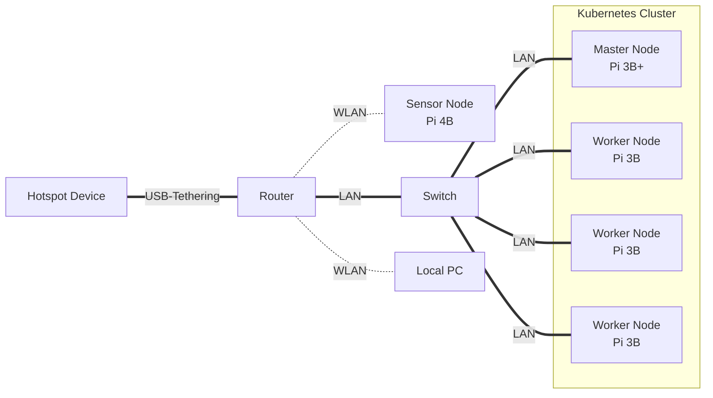
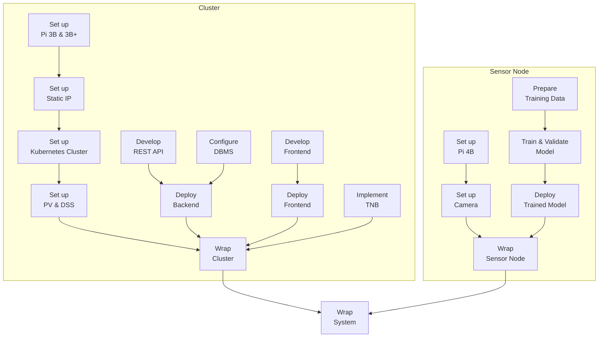
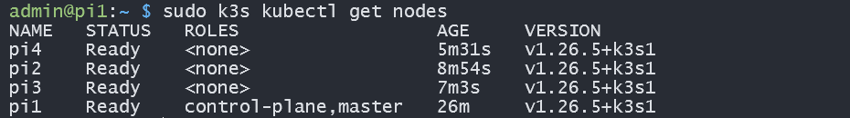

TODO: Table of contents

# Overview

**Introduction**: The project *Automatic Pet Detection With Edge Computing* is part of the Cloud Computing SS23 module of Prof. Dr. Christian Baun at the Frankfurt University of Applied Sciences. Further information about the module can be found [here](https://www.christianbaun.de/CGC23/index.html).

**Objective**: This project aims to develop an edge computing solution for the automatic detection of cats and dogs. General steps to achieve the project goal are listed in the **Project Plan** part of this Overview section.

**Duration**: 12.04.2023 - 05.07.2023

**Source Code**: [Link](https://github.com/ccfrauasgr2/pet-detection/tree/main)

**Presentation Slides**: [Link](https://docs.google.com/presentation/d/1wE96Q1euAeaRYBAPP1TrVFQCkrlQES2NmLTt2wVjyIs/edit?usp=sharing)

**Hardware**:

Received from Prof.:

- 1x Raspberry Pi 4 Model B (Pi 4B)
- 1x Raspberry Pi 3 Model B+ (Pi 3B+)
- 3x Raspberry Pi 3 Model B V1.2 (Pi 3B)
- 5x Samsung EVO Plus 32GB MicroSDHC
- 1x Apple USB-C-to-USB-C Charger
- 1x Anker 6-Port PowerPort
- 2x TP-Link TL-SG105 5-Port Desktop Switch
- 6x LAN Cable
- 4x CoolReal USB-C-to-USB-C Cable
- 1x Raspberry Pi Camera Module 2 (Camera Module)

Obtained from own source:

- 1x FRITZ!Box 3272 Router
- 1x USB-to-USB-C Cable

**Network Architecture**:



**System Architecture**:


| Component                              | Role                                                                                                                                                                                |
| -------------------------------------- | ----------------------------------------------------------------------------------------------------------------------------------------------------------------------------------- |
| Camera                                 | captures visual data and sends them to the sensor node                                                                                                                              |
| Detection Model                        | analyzes visual data to detect and classify pet                                                                                                                                     |
| Persistent Volume (PV)                 | serves as the shared persistent storage resource in the cluster                                                                                                                     |
| Distributed Storage System (DSS)       | manages the underlying storage infrastructure of the persistent volume, allows concurrent read and write operations to the shared persistent volume, ensures high data availability |
| Frontend Pod+                          | provides user interface and handles user interactions, scalable                                                                                                                     |
| REST API Pod+                          | exposes endpoints to facilitate communication and data exchange between system components, scalable                                                                                 |
| Database Management System (DBMS) Pod+ | handles write and read queries for storing and retrieving detection results, scalable                                                                                               |
| Telegram Notification Bot (TNB)        | notifies user about detection results via Telegram                                                                                                                                  |


**System Behavior**:

TODO: Text description
> **_IDEA:_**
> - Live detection
> - Detect phase starts when the model detects pet for the first time (since the beginning of live detection OR after the previous detect phase ends).
> - Detect phase ends when the model no longer detects pet.
> - Telegram notifications are sent at the beginning and at the end of each detect phase.
> - The first detection result (successful pet detection) is sent right away to the cluster for Telegram notification.
> - Beside the first detection result, only subsequent detection results at 2- or 3-second intervals until the detect phase ends are sent to the cluster.
> - These detection results should be sent in batches to reduce overhead and improve efficiency. 
> - This process can be realized by using the REST API and a buffer in the sensor node: If the buffer reaches a certain size or timer, the detection results are sent to the REST API in the sensor node in batches. When the detect phase ends, any remaining results in the buffer are also sent to the REST API in the sensor node in batches.
> - The REST API containers in the cluster receive the detection results and store them in the persistent volume.
> - The frontend containers on the worker nodes periodically query the REST API containers for any new detected pets and display them.

Telegram message when detect phase starts:

`A wild Pikachu appeared!` (LOL - Just kidding)

`<ANIMAL_TYPES> detected at <START_TIME> on <DATE>`

`<PHOTO_WITH_BOUNDING_BOXES_&_ANIMAL_TYPES_&_CONF_VALUE>`

Telegram message when detect phase ends: 

`In <DURATION> seconds from <START_TIME> to <END_TIME> on <DATE>: <ANIMAL_TYPEs> were detected, X pictures were taken, and the highest confidence value is <HIGHEST_CONF_VALUE> `


**Project Plan**:


**Group 2 Info & Task Distribution**:

| Member              | MatrNr. | Uni-Mail                            | Tasks                                                                                                       |
| ------------------- | ------- | ----------------------------------- | ----------------------------------------------------------------------------------------------------------- |
| Vincent Roßknecht   | 1471764 | vincent.rossknecht@stud.fra-uas.de  | Prepare Training Data<br/>Train & Validate Model                                                            |
| Jonas Hülsmann      | 1482889 | jonas.huelsman@stud.fra-uas.de      | Develop REST API<br/>Implement TNB                                                                          |
| Marco Tenderra      | 1251463 | tenderra@stud.fra-uas.de            | Set up Pi 4B<br/>Set up Camera<br/>Prepare Training Data<br/>Develop REST API                               |
| Minh Kien Nguyen    | 1434361 | minh.nguyen4@stud.fra-uas.de        | Set up Pi 3B & 3B+<br/>Set up Static IP<br/>Set up Kubernetes Cluster<br/>Set up PV & DSS<br/>Implement TNB |
| Alexander Atanassov | 1221846 | alexander.atanassov@stud.fra-uas.de | Develop Frontend<br/>Develop REST API                                                                       |


# Sensor Node

## Set up Pi 4B
- Insert an empty SD-Card into local PC.
- Install then run [Raspberry Pi Imager](https://www.raspberrypi.com/software/) on local PC.
- In the Raspberry Pi Imager:
  - For Operating System, select `Raspberry Pi OS Lite (32-bit)`.
  - For Storage, select the inserted SD-Card.
  - In Advanced options (Cog icon):
    - Set `pi0` as hostname.
    - Set `admin` as username and set own password.
    - Enable `Enable SSH` and `Use password authentication` options. This allows for remote access and control of Pi 4B via SSH from local PC. 
    - Enable `Configure wireless LAN` option, type in the SSID and password of the router so that Pi 4B will automatically connect to the router network. For more information see [Set up Static IP](#set-up-static-ip).
    - To save the above advance options for further use, set Image customization options to `to always use`.
  - Write to SD-Card.
- [Connect](https://projects.raspberrypi.org/en/projects/raspberry-pi-setting-up/3) and [Start up](https://projects.raspberrypi.org/en/projects/raspberry-pi-setting-up/4) Pi 4B with SD-Card.
- [SSH into](https://www.makeuseof.com/how-to-ssh-into-raspberry-pi-remote/#:~:text=SSH%20Into%20Raspberry%20Pi%20From%20Windows&text=In%20the%20PuTTY%20dialog%2C%20select,the%20connection%20details%20in%20PuTTY.) Pi 4B from local PC with the command `ssh admin@pi0.local`
- Update system packages with `sudo apt update` then `sudo apt upgrade -y`  
- SSH only provides *terminal* access to Pi 4B. To *remotely control the desktop interface* of Pi 4B, we use VNC (Virtual Network Computing). To enable VNC connection:
  - First, enable VNC Server on Pi 4B. SSH into Pi 4B from local PC, then enter `sudo raspi-config`. Now with the arrows select `Interfacing Options`, navigate to `VNC`, choose `Yes`, and select `Ok`.
  - Install [Real VNC Viewer](https://www.realvnc.com/en/connect/download/viewer/) on local PC.
  - Open local VNC Viewer, enter `pi0.local:0` or `[IP address of Pi 4B]`. To find the IP address of Pi 4B, SSH into Pi 4B from local PC, then enter `hostname -I`.
  - Enter login credentials that were set while configuring Raspberry Pi Imager.
  - The VNC session should start, and the Raspberry Pi desktop should be available.

## Set up Camera

- To connect Camera Module to Pi 4B, follow the steps listed in [Connect the Camera Module](https://projects.raspberrypi.org/en/projects/getting-started-with-picamera/2). Make sure the Camera Module faces the USB and Ethernet ports.
- To test if the connection is working, enter `libcamera-still -o test.jpg` to capture a single image. For more information about `libcamera-still`, refer to [this documentation](https://www.raspberrypi.com/documentation/computers/camera_software.html#libcamera-and-libcamera-apps).

## Prepare Training Data

## Train & Validate Model

## Deploy Trained Model

## Wrap Sensor Node

# Cluster

## Set up Pi 3B & 3B+

- Follow the steps listed in [Set up Pi 4B](#set-up-pi-4b), but disable `Configure wireless LAN` option, and **DO NOT SSH into each Pi 3 yet!** Do that after [Set up Static IP](#set-up-static-ip) is done.
- For Operating System, select `Raspberry Pi OS Lite (64-bit)`.
- Set `pi1` as hostname for Pi 3B+, and `pi2`, `pi3`, `pi4` as hostname for each of three available Pi 3B.

## Set up Static IP

For a Kubernetes cluster to work, the worker nodes must know the IP address of the master (controller) node and vice versa, so that they can communicate with each other. If the nodes' IP addresses change during communication, the Kubernetes cluster won't work. It is therefore critical that the master and worker nodes be assigned static (fixed) IP addresses. For that purpose, we use an additional FRITZ!Box Router. Here are the steps to set up static IP addresses:

- Turn on all hardware shown in the Network Architecture part of the [Overview section](#overview).
- Share the hotspot device's internet connection with the router through USB-Tethering.
- Connect local PC and all Pi with the router network.
- On local PC, enter `ipconfig` on Command Prompt (in Windows) and look for the Default Gateway IP address of the router network (`192.168.178.1` in our case).
- Still on local PC, enter the IP address just found in a browser to open the router (FRITZ!Box) user interface (see below image; `KIEN-LEGION5` and `Google Pixel 5` were the local PC and hotspot device used, respectively).

  

- [Assign static IP addresses to all available Pi](https://www.giga.de/hardware/avm-fritz-box-fon-wlan-7390/tipps/fritzbox-feste-ip-vergeben-so-geht-s/), then restart all Pi.

  | Raspberry Pi | Assigned IP Address | Connection |
  | ------------ | ------------------- | ---------- |
  | ``pi1``      | `192.168.178.61`    | LAN        |
  | ``pi2``      | `192.168.178.62`    | LAN        |
  | ``pi3``      | `192.168.178.63`    | LAN        |
  | ``pi4``      | `192.168.178.64`    | LAN        |
- To check if the setup works, restart hotspot device, then share its internet connection again. All Pi should still have the same static IP addresses assigned to them.
  
  
  

After setting up static IP, we will enable passwordless, SSH-key-based login from local PC to each Pi 3:

- First, add the block below to the `known_hosts` file located in the `.ssh` folder within home directory of local PC (Windows).

  ```
  192.168.178.61 pi1 pi1.local
  192.168.178.62 pi2 pi2.local
  192.168.178.63 pi3 pi3.local
  192.168.178.64 pi4 pi4.local
  ```
- Next, generate SSH key on local PC with:

  ```
  # Do not fill anything when asked, just hit "Enter"
  ssh-keygen -t rsa -b 2048
  # Public key location: ~/.ssh/id_rsa.pub (Windows)
  ```
- Finally, copy the generated SSH key to each Pi 3 and finish setting them up.

  ```
  # SSH into each Pi 3, make sure you are user <admin>
  # E.g., on local PC:
  ssh admin@pi1

  # Once logged in, go to <admin>'s home directory and create directory ".ssh"
  cd
  mkdir -p ~/.ssh

  # Open new file "authorized_keys" in the ".ssh" directory
  sudo nano ~/.ssh/authorized_keys
  # Paste the contents of the public key "id_rsa.pub" on local PC into this file. 
  # Hit "Ctrl" + "X" -> "Y" -> "Enter" to save changes.

  # Update system packages
  sudo apt update && sudo apt upgrade -y

  # Disable IPv6
  sudo nano /boot/cmdline.txt
  # Append "ipv6.disable=1" at the end of the first line. 
  # It is important that there is no line break added.
  # Hit "Ctrl" + "X" -> "Y" -> "Enter" to save changes.

  # Reboot each node, so that all changes thus far take place.
  sudo reboot
  ```

## Set up Kubernetes Cluster

Given [the hardware specifications of the four Raspberry Pi 3](https://www.raspberrypi.com/products/raspberry-pi-3-model-b-plus/), it is best to set them up as a Kubernetes cluster with [`k3s`](https://docs.k3s.io/) - a lightweight Kubernetes distribution suitable for edge computing. One Raspberry Pi 3 (`pi1`) will be used as master node, while the other three (`pi2, pi3, pi4`) will be used as worker nodes. For more information about the design of the Kubernetes cluster, see [Set up Kubernetes Cluster](#set-up-kubernetes-cluster).

As previously mentioned, the Kubernetes cluster consists of one Raspberry Pi 3 (`pi1`) designated as the master (server) node, and the remaining three Raspberry Pi 3 (`pi2, pi3, pi4`) serve as worker (agent) nodes. The main drawback of this design is the only master node, which is *the* single point of failure of the whole cluster. Thus, to ensure high availability of the cluster, it was also considered to use two Raspberry Pi 3 as master nodes and the other two as worker nodes. However, this design was discarded, because [performance issues exist on slower disks such as Raspberry Pis running with SD cards, and ``k3s`` requires three or more server nodes to run a multiple-server Kubernetes cluster](https://docs.k3s.io/datastore/ha-embedded).


Here are the steps to set up a Kubernetes cluster with the four available Raspberry Pi 3:

- Run `curl -sfL https://get.k3s.io | sh -` to install `k3s server` on `pi1` (the designated master node).
- Still on `pi1`, run `sudo cat /var/lib/rancher/k3s/server/node-token` to get the `<k3s-token>` of the master node. 
- On each `pi2, pi3, pi4` (the designated worker nodes), run `curl -sfL https://get.k3s.io | K3S_URL=https://192.168.178.61:6443 K3S_TOKEN=<k3s-token> sh -` to install `k3s agent`.
- Run `sudo k3s kubectl get nodes` on `pi1` to check if the set up works. All nodes should be available and have status `Ready`.
  
  
- To easily applying YAML files from local PC for future deployments on the Kubernetes cluster (see sections with "Deploy" in title), it is recommended to configure ``kubectl`` on local PC:
  - First, [install `kubectl` on local PC](https://kubernetes.io/docs/tasks/tools/).
  - Then, on `pi1`, open the file `/etc/rancher/k3s/k3s.yaml` with `sudo cat /etc/rancher/k3s/k3s.yaml` and copy its content.
  - Paste the copied content in the `config` file normally available at `~/.kube/config` (`~` denotes home directory on local PC; if `.kube/config` is unavailable, create one). Here it is crucial to replace the localhost IP ``127.0.0.1`` with the static IP address of the master node (`192.168.178.61`). Everything else can stay the same. 

    ```
    apiVersion: v1
    clusters:
    - cluster:
        certificate-authority-data: ...
        server: https://192.168.178.61:6443
      name: k3s-cluster
    contexts:
    - context:
        cluster: k3s-cluster
        user: k3s-admin
      name: k3s
    current-context: k3s
    kind: Config
    preferences: {}
    users:
    - name: k3s-admin
      user:
        client-certificate-data: ...
        client-key-data: ...
    ```

## Set up PV & DSS

We decided to use [Longhorn](https://longhorn.io/docs/1.4.2/what-is-longhorn/) for DSS. A comparison between Longhorn and other available options for DSS can be found [here](https://rpi4cluster.com/k3s/k3s-storage-setting/). In summary, Longhorn excels in its ease of setup, lightweight nature, and suitability for meeting the project's needs in terms of scalability, high availability, and high I/O performance.

To enable shared storage inside the Kubernetes cluster, all DBMS pods will share a Longhorn volume (a customized Kubernetes Persistent Volume). Longhorn stores replicas of data on all worker nodes' storage resources, ensuring persistent data storage and high data availability.

Here are the steps to set up Longhorn on the Kubernetes cluster:

- First, install [these prerequisites](https://longhorn.io/docs/1.4.2/deploy/install/#installation-requirements) on each node.
- 2
- 3

## Develop REST API

## Configure DBMS

## Deploy Backend

## Develop Frontend

## Deploy Frontend

## Implement TNB

## Wrap Cluster


