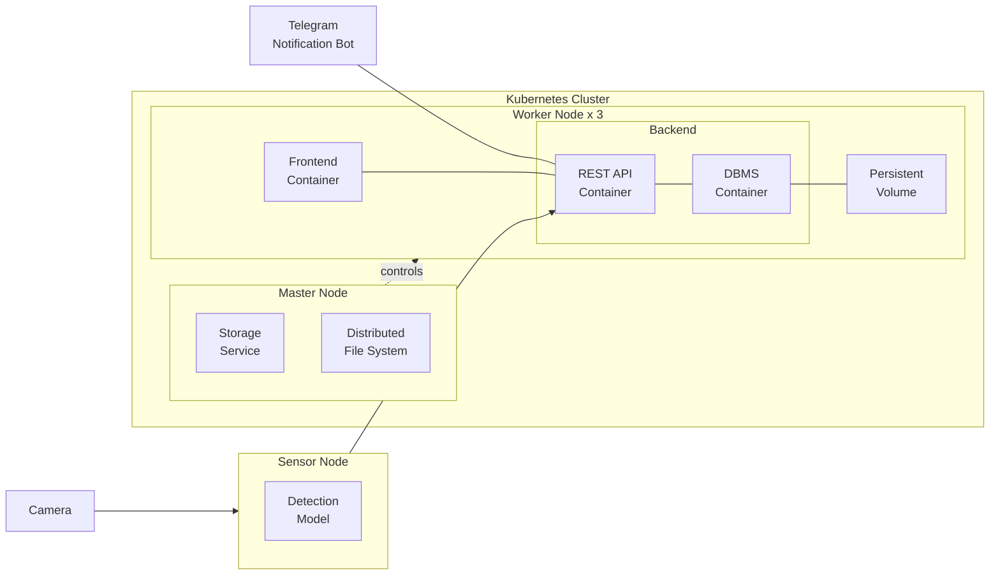
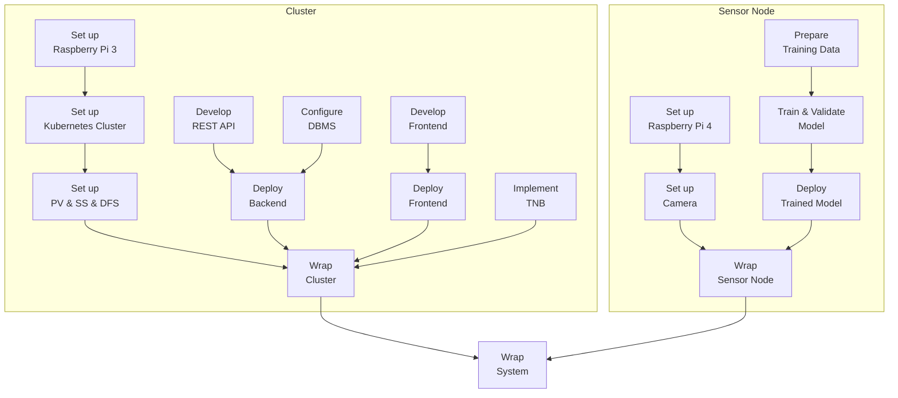

TODO: Table of contents

# Overview

**Introduction**: The project *Automatic Pet Detection With Edge Computing* is part of the Cloud Computing SS23 module of Prof. Dr. Christian Baun at the Frankfurt University of Applied Sciences. Further information about the module can be found [here](https://www.christianbaun.de/CGC23/index.html).

**Objective**: This project aims to develop an edge computing solution for the automatic detection of cats, dogs, golden hamster. General steps to achieve the project goal are:
- Set up a Sensor Node (Raspberry Pi 4) with Camera Modules
- Train a Model to Detect Pets
- Deploy the Trained Model on the Sensor Node
- Set up a Cluster of Raspberry Pi 3 Nodes
- Set up a Database for Storing Detection Results 
- Develop a WebApp for Displaying Detection Results
- Develop API Connection Between the Sensor Node, Cluster & WebApp
- Test Full System

**Duration**: 12.04.2023 - 05.07.2023

**Source Code**: [Link](https://github.com/ccfrauasgr2/pet-detection/tree/main)

**Presentation Slides**: [Link](https://docs.google.com/presentation/d/1wE96Q1euAeaRYBAPP1TrVFQCkrlQES2NmLTt2wVjyIs/edit?usp=sharing)

**Hardware**:
- 1 Raspberry Pi 4 Model B with 32 GB MicroSD
- 4 Raspberry Pi 3 Model B with 4x 32 GB MicroSD
- 1 Apple charger with USB-C to USB-C
- 1 Anker PowerPort with 6 Ports
- 2 TP-Link TL-SG105 5 Port Desktop switch
- 6 Lan Cable
- 4 CoolReal USB-C to USB-C Cable
- 1 Raspberry Pi Camera Module 2

**System Architecture**:

| Component                                   | Role                                                                                      |
| ------------------------------------------- | ----------------------------------------------------------------------------------------- |
| Camera                                      | captures visual data and sends them to the sensor node                                    |
| Detection Model                             | analyzes visual data to detect and classify pet                                           |
| Persistent Volume (PV)                      | serves as the persistent storage resource in the cluster                                  |
| Storage Service   (SS)                      | manages the underlying storage infrastructure of the persistent volume                    |
| Distributed File System (DFS)               | allows nodes in the cluster to access and share the same persistent volume                |
| Frontend Container                          | provides user interface and handles user interactions                                     |
| REST API Container                          | exposes endpoints to facilitate communication and data exchange between system components |
| Database Management System (DBMS) Container | handles write and read queries for storing and retrieving detection results               |
| Telegram Notification Bot (TNB)             | sends detection result notifications to user's Telegram account                           |

**System Behavior**:

TODO: Text description
> **_IDEA:_**
> - Live detection
> - Detect phase starts when the model detects pet for the first time (since the beginning of live detection OR after the previous detect phase ends).
> - Detect phase ends when the model no longer detects pet.
> - Telegram notifications are sent at the beginning and at the end of each detect phase.
> - The first detection result (successful pet detection) is sent right away to the cluster for Telegram notification.
> - Beside the first detection result, only subsequent detection results at 2- or 3-second intervals until the detect phase ends are sent to the cluster.
> - These detection results should be sent in batches to reduce overhead and improve efficiency. 
> - This process can be realized by using the REST API and a buffer in the sensor node: If the buffer reaches a certain size or timer, the detection results are sent to the REST API in the sensor node in batches. When the detect phase ends, any remaining results in the buffer are also sent to the REST API in the sensor node in batches.
> - The REST API containers in the cluster receive the detection results and store them in the persistent volume.
> - The frontend containers on the worker nodes periodically query the REST API containers for any new detected pets and display them.

Telegram message when detect phase starts:

`A wild Pikachu appeared!` (LOL - Just kidding)

`<ANIMAL_TYPES> detected at <START_TIME> on <DATE>`

`<PHOTO_WITH_BOUNDING_BOXES_&_ANIMAL_TYPES_&_CONF_VALUE>`

Telegram message when detect phase ends: 

`In <DURATION> seconds from <START_TIME> to <END_TIME> on <DATE>: <ANIMAL_TYPEs> were detected, X pictures were taken, and the highest confidence value is <HIGHEST_CONF_VALUE> `

**Project Plan**:

**Group 2 Info & Task Distribution**:

| Member              | MatrNr. | Uni-Mail                            | Tasks                                                           |
| ------------------- | ------- | ----------------------------------- | --------------------------------------------------------------- |
| Vincent Roßknecht   | 1471764 | vincent.rossknecht@stud.fra-uas.de  | Train & Validate Model                                          |
| Jonas Hülsmann      | 1482889 | jonas.huelsman@stud.fra-uas.de      | Set up Raspberry 3, Set up Kubernetes Cluster, Develop REST API |
| Ekrem Bugday        | 1325425 | ekrem.bugday@stud.fra-uas.de        |                                                                 |
| Marco Tenderra      | 1251463 | tenderra@stud.fra-uas.de            | Set up Raspberry 4, Set up Camera,                              |
| Minh Kien Nguyen    | 1434361 | minh.nguyen4@stud.fra-uas.de        | Implement TNB                                                   |
| Alexander Atanassov | 1221846 | alexander.atanassov@stud.fra-uas.de | Develop Frontend                                                |

# Sensor Node

The following questions have to be answered:

- What is the general purpose of the component?
- Which tools/service/tech stacks were used and why?
- How were these used to achieve the general purpose?
- Example Results
- Known problems and improvement suggestions

## Set up Raspberry Pi 4
- Insert an empty SD-Card into local PC
- Install then run [Raspberry Pi Imager](https://www.raspberrypi.com/software/) on local PC
- In the Raspberry Pi Imager:
  - For Operating System, select Raspberry Pi OS (32-bit/64-bit)
  - For Storage, select the inserted SD-Card
  - In Advanced options (Cog icon):
    - Set `pi0` as hostname
    - Set `admin` as username
    - Enable `Enable SSH` and `Use password authentication` options. This allows for remote access and control of Raspberry Pi 4 via SSH from local PC. 
    - Enable `Configure wireless LAN` option, then add network details so that Raspberry Pi 4 will automatically connect to the network
  - Write to SD-Card
- [Connect](https://projects.raspberrypi.org/en/projects/raspberry-pi-setting-up/3) and [Start up](https://projects.raspberrypi.org/en/projects/raspberry-pi-setting-up/4) Raspberry Pi 4 with SD-Card
- [SSH into Raspberry Pi](https://www.makeuseof.com/how-to-ssh-into-raspberry-pi-remote/#:~:text=SSH%20Into%20Raspberry%20Pi%20From%20Windows&text=In%20the%20PuTTY%20dialog%2C%20select,the%20connection%20details%20in%20PuTTY.) 4 from local PC with the command `ssh admin@pi0.local`
- SSH only provides *terminal* access to Raspberry Pi 4. To *remotely control the desktop interface* of Raspberry Pi 4, we use VNC (Virtual Network Computing). To enable VNC connection:
  - First, enable VNC Server on Raspberry Pi 4. SSH into Raspberry Pi 4 from local PC, then enter `sudo raspi-config`. Now with the arrows select `Interfacing Options`, navigate to `VNC`, choose `Yes`, and select `Ok`.
  - Install [Real VNC Viewer](https://www.realvnc.com/en/connect/download/viewer/) on local PC
  - Open local VNC Viewer, enter `pi0.local:0` or `[IP address of Raspberry Pi 4]`. To find the IP address of Raspberry Pi 4, SSH into Raspberry Pi 4 from local PC, then enter `hostname -I`.
  - Enter login credentials that were set while configuring Raspberry Pi Imager.
  - The VNC session should start, and the Raspberry Pi desktop should be available.

## Set up Camera

## Prepare Training Data

## Train & Validate Model

## Deploy Trained Model

## Wrap Sensor Node

# Cluster

The following questions have to be answered:

- What is the general purpose of the component?
- Which tools/service/tech stacks were used and why?
- How were these used to achieve the general purpose?
- Example Results
- Known problems and improvement suggestions

## Set up Raspberry Pi 3

- Follow the steps listed in [Set up Raspberry Pi 4](#set-up-raspberry-pi-4)
- Set `pi[1|2|3|4]` as hostname for each of four available Raspberry Pi 3

## Set up Kubernetes Cluster

## Set up Storage Service

## Set up PV & SS & DFS

## Develop REST API

## Configure DBMS

## Deploy Backend

## Develop Frontend

## Deploy Frontend

## Implement TNB

## Wrap Cluster

