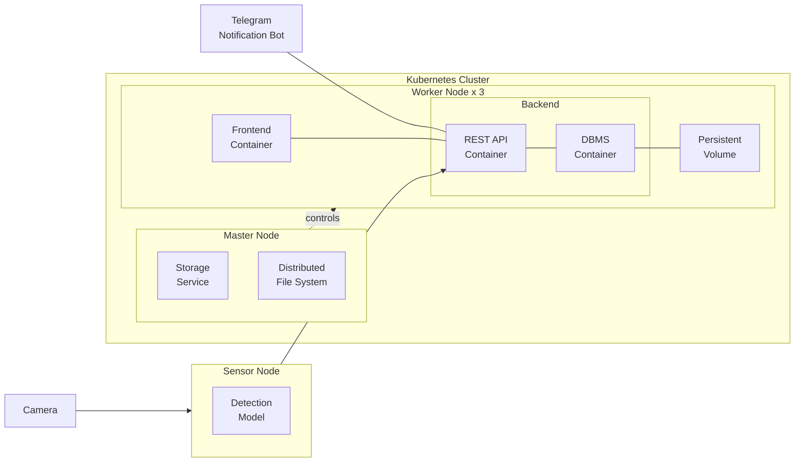
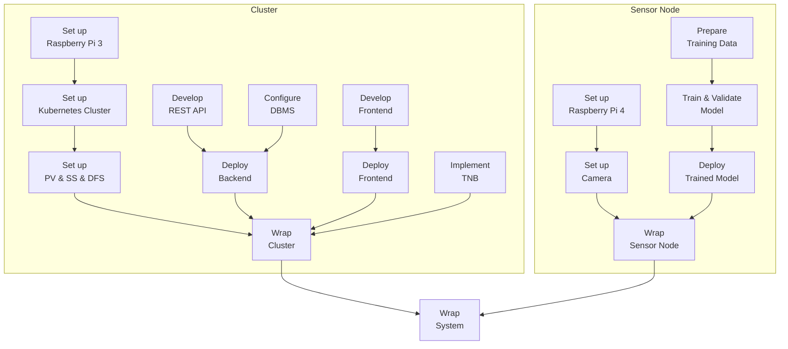

TODO: Table of contents

# Overview

**Introduction**: The project *Automatic Pet Detection With Edge Computing* is part of the Cloud Computing SS23 module of Prof. Dr. Christian Baun at the Frankfurt University of Applied Sciences. Further information about the module can be found [here](https://www.christianbaun.de/CGC23/index.html).

**Objective**: This project aims to develop an edge computing solution for the automatic detection of cats, dogs, golden hamster. General steps to achieve the project goal are:
- Set up a Sensor Node (Raspberry Pi 4) with Camera Modules
- Train a Model to Detect Pets
- Deploy the Trained Model on the Sensor Node
- Set up a Cluster of Raspberry Pi 3 Nodes
- Set up a Database for Storing Detection Results 
- Develop a WebApp for Displaying Detection Results
- Develop API Connection Between the Sensor Node, Cluster & WebApp
- Test Full System

**Duration**: 12.04.2023 - 05.07.2023

**Source Code**: [Link](https://github.com/ccfrauasgr2/pet-detection/tree/main)

**Presentation Slides**: [Link](https://docs.google.com/presentation/d/1wE96Q1euAeaRYBAPP1TrVFQCkrlQES2NmLTt2wVjyIs/edit?usp=sharing)

**Hardware**:
- 1 Raspberry Pi 4 Model B with 32 GB MicroSD
- 4 Raspberry Pi 3 Model B with 4x 32 GB MicroSD
- 1 Apple charger with USB-C to USB-C
- 1 Anker PowerPort with 6 Ports
- 2 TP-Link TL-SG105 5 Port Desktop switch
- 6 Lan Cable
- 4 CoolReal USB-C to USB-C Cable
- 1 Raspberry Pi Camera Module 2

**System Architecture**:



| Component                                   | Role                                                                                      |
| ------------------------------------------- | ----------------------------------------------------------------------------------------- |
| Camera                                      | captures visual data and sends them to the sensor node                                    |
| Detection Model                             | analyzes visual data to detect and classify pet                                           |
| Persistent Volume (PV)                      | serves as the persistent storage resource in the cluster                                  |
| Storage Service   (SS)                      | manages the underlying storage infrastructure of the persistent volume                    |
| Distributed File System (DFS)               | allows nodes in the cluster to access and share the same persistent volume                |
| Frontend Container                          | provides user interface and handles user interactions                                     |
| REST API Container                          | exposes endpoints to facilitate communication and data exchange between system components |
| Database Management System (DBMS) Container | handles write and read queries for storing and retrieving detection results               |
| Telegram Notification Bot (TNB)             | notifies user about detection results via Telegram                                        |

**System Behavior**:

TODO: Text description
> **_IDEA:_**
> - Live detection
> - Detect phase starts when the model detects pet for the first time (since the beginning of live detection OR after the previous detect phase ends).
> - Detect phase ends when the model no longer detects pet.
> - Telegram notifications are sent at the beginning and at the end of each detect phase.
> - The first detection result (successful pet detection) is sent right away to the cluster for Telegram notification.
> - Beside the first detection result, only subsequent detection results at 2- or 3-second intervals until the detect phase ends are sent to the cluster.
> - These detection results should be sent in batches to reduce overhead and improve efficiency. 
> - This process can be realized by using the REST API and a buffer in the sensor node: If the buffer reaches a certain size or timer, the detection results are sent to the REST API in the sensor node in batches. When the detect phase ends, any remaining results in the buffer are also sent to the REST API in the sensor node in batches.
> - The REST API containers in the cluster receive the detection results and store them in the persistent volume.
> - The frontend containers on the worker nodes periodically query the REST API containers for any new detected pets and display them.

Telegram message when detect phase starts:

`A wild Pikachu appeared!` (LOL - Just kidding)

`<ANIMAL_TYPES> detected at <START_TIME> on <DATE>`

`<PHOTO_WITH_BOUNDING_BOXES_&_ANIMAL_TYPES_&_CONF_VALUE>`

Telegram message when detect phase ends: 

`In <DURATION> seconds from <START_TIME> to <END_TIME> on <DATE>: <ANIMAL_TYPEs> were detected, X pictures were taken, and the highest confidence value is <HIGHEST_CONF_VALUE> `


**Project Plan**:


**Group 2 Info & Task Distribution**:

| Member              | MatrNr. | Uni-Mail                            | Tasks                                                           |
| ------------------- | ------- | ----------------------------------- | --------------------------------------------------------------- |
| Vincent Roßknecht   | 1471764 | vincent.rossknecht@stud.fra-uas.de  | Train & Validate Model                                          |
| Jonas Hülsmann      | 1482889 | jonas.huelsman@stud.fra-uas.de      | Set up Raspberry 3, Set up Kubernetes Cluster, Develop REST API |
| Ekrem Bugday        | 1325425 | ekrem.bugday@stud.fra-uas.de        |                                                                 |
| Marco Tenderra      | 1251463 | tenderra@stud.fra-uas.de            | Set up Raspberry 4, Set up Camera,                              |
| Minh Kien Nguyen    | 1434361 | minh.nguyen4@stud.fra-uas.de        | Implement TNB                                                   |
| Alexander Atanassov | 1221846 | alexander.atanassov@stud.fra-uas.de | Develop Frontend                                                |


# Sensor Node

The following questions have to be answered:

- What is the general purpose of the component?
- Which tools/service/tech stacks were used and why?
- How were these used to achieve the general purpose?
- Example Results
- Known problems and improvement suggestions

## Set up Raspberry Pi 4
- Insert an empty SD-Card into local PC
- Install then run [Raspberry Pi Imager](https://www.raspberrypi.com/software/) on local PC
- In the Raspberry Pi Imager:
  - For Operating System, select Raspberry Pi OS (32-bit/64-bit)
  - For Storage, select the inserted SD-Card
  - In Advanced options (Cog icon):
    - Set `pi0` as hostname
    - Set `admin` as username
    - Enable `Enable SSH` and `Use password authentication` options. This allows for remote access and control of Raspberry Pi 4 via SSH from local PC. 
    - Enable `Configure wireless LAN` option, then add network details so that Raspberry Pi 4 will automatically connect to the network
  - Write to SD-Card
- [Connect](https://projects.raspberrypi.org/en/projects/raspberry-pi-setting-up/3) and [Start up](https://projects.raspberrypi.org/en/projects/raspberry-pi-setting-up/4) Raspberry Pi 4 with SD-Card
- [SSH into Raspberry Pi](https://www.makeuseof.com/how-to-ssh-into-raspberry-pi-remote/#:~:text=SSH%20Into%20Raspberry%20Pi%20From%20Windows&text=In%20the%20PuTTY%20dialog%2C%20select,the%20connection%20details%20in%20PuTTY.) 4 from local PC with the command `ssh admin@pi0.local`
- SSH only provides *terminal* access to Raspberry Pi 4. To *remotely control the desktop interface* of Raspberry Pi 4, we use VNC (Virtual Network Computing). To enable VNC connection:
  - First, enable VNC Server on Raspberry Pi 4. SSH into Raspberry Pi 4 from local PC, then enter `sudo raspi-config`. Now with the arrows select `Interfacing Options`, navigate to `VNC`, choose `Yes`, and select `Ok`.
  - Install [Real VNC Viewer](https://www.realvnc.com/en/connect/download/viewer/) on local PC
  - Open local VNC Viewer, enter `pi0.local:0` or `[IP address of Raspberry Pi 4]`. To find the IP address of Raspberry Pi 4, SSH into Raspberry Pi 4 from local PC, then enter `hostname -I`.
  - Enter login credentials that were set while configuring Raspberry Pi Imager.
  - The VNC session should start, and the Raspberry Pi desktop should be available.

## Set up Camera

- To connect Raspberry Pi Camera Module 2 to Raspberry Pi 4, follow the steps listed in [Connect the Camera Module](https://projects.raspberrypi.org/en/projects/getting-started-with-picamera/2). Make sure the Camera Module faces the USB and Ethernet ports.
- To test if the connection is working, enter `libcamera-still -o test.jpg` to capture a single image. For more information about `libcamera-still`, refer to [this documentation](https://www.raspberrypi.com/documentation/computers/camera_software.html#libcamera-and-libcamera-apps).

## Prepare Training Data
1. Download unannotated cat and dog images from [kaggle](https://www.kaggle.com/)
2. Annotate images using MegaDetector from which we recieve a .json annotation file for all images. Since MegaDetector can only differentiate between `Animals`, `Humans` and `Vehicles` the downloaded cat and dog images are kept seperated. Therefore we have 2 .json files with the MegaDetector annotation, one for cats and one for dogs. For some images MegaDetector couldn't find an annotation, because the quality of the image wasn't good enough. In total this leaves ~35.000 images in the dataset which is sufficient for training.
3. Convert the annotation format to the YOLOv8 format using the `convert_to_yolov8_annotation.py` [script](https://github.com/ccfrauasgr2/pet-detection/tree/main/sensor_node/model_training). The annotations are extracted from the 2 .json files and are written into multiple .txt files. The YOLOv8 annotation format requires one .txt annotation file for every image. Furthermore the annotation for the bounding box itself changes from Megadetector:<br>
`<class> x_top_left_bbox, y_top_left_bbox, width_bbox, height_bbox`<br>
to YOLOv8<br>
`<class> x_center_bbox, y_center_bbox, width_bbox, height_bbox`<br>
More on the YOLOv8 annotation can be found [here](https://medium.com/@connect.vin/yat-an-open-source-data-annotation-tool-for-yolo-8bb75bce1767).<br>
The following representation shows the difference between the MegaDetector and the YOLOv8 annotation in more detail.

<table border="0", class="fixed">
<col width="35px">
<col width="250px">
<col width="250px">
 <tr>
    <td><b style="font-size:20px"></b></td>
    <td><b style="font-size:20px">MegaDetector</b></td>
    <td><b style="font-size:20px">YOLOv8</b></td>
 </tr>
<tr>
<td></td>
<td>

```
dataset/
├── cats
│   ├── megaDetector.json
│   ├── cat_0.png
│   ├── cat_1.png
│   ├── cat_2.png
│   ├── ...
├── dogs
│   ├── megaDetector.json
│   ├── dog_0.png
│   ├── dog_1.png
│   ├── dog_2.png
│   └── ...


```

</td>
<td>

```
dataset/
├── cats
│   ├── images
│   │   ├── cat_0.png
│   │   ├── cat_1.png
│   │   ├── cat_2.png
│   │   └── ...
│   └── annotation
│       ├── cat_0.txt
│       ├── cat_1.txt
│       ├── cat_2.txt
│       └── ...
├── dogs
│   ├── images
│   │   ├── dog_0.png
│   │   ├── dog_1.png
│   │   ├── dog_2.png
│   │   └── ...
│   └── annotation
│       ├── dog_0.txt
│       ├── dog_1.txt
│       ├── dog_2.txt
│       └── ...
```

</td>
</tr>
</table>

4. Split the dataset into training, validation and test images. The number of images and the split we used:

| Pet | Training | Validation | Test |
| ---- | ---- | ---- | ---- |
| Cat | 13.875 | 1.816 | 1.740 |
| Dog | 14.782 | 1.871 | 1.848 |
| Sum | 28.657 | 3.687 | 3.588 |

So we have the following training-validation-test split: 79.75%, 10.27%, 9.98%

## Train & Validate Model
We chose the YOLOv8 model, since it is the best choice for object detection, comparison with other models can be found [here](https://www.stereolabs.com/blog/performance-of-yolo-v5-v7-and-v8/). The training and validation for the YOLOv8 model is done in Google Colab. First we need to setup the Google Colab notebook. To train a YOLOv8 model install ultralytics, this project was done with version 8.0.105.
```python
!pip install ultralytics
import ultralytics
```
In addition, it is necessary to establish a connection with Google Drive to conveniently access the training and validation datasets.
```python
from google.colab import drive
drive.mount('/content/drive')
```
When dealing with a large number of files in Google Colab, it is advisable to compress the datasets into .zip files before uploading. It is also recommended to make three distinct .zip files for the training, validation, and test datasets. After uploading them to Google Drive, the .zip files can then be easily extracted using the `!unzip` command within the Google Colab notebook.<br>
```python
!unzip '/content/drive/pathToZipFile/train.zip'
!unzip '/content/drive/pathToZipFile/validate.zip'
!unzip '/content/drive/pathToZipFile/test.zip'
```
After this there should be 3 folders in the direct environment of the Google Colab Notebook. Now we can start training, for better performance choose a GPU runtime in Google Colab (Runtime -> Change runtime type). In this project we used a Nvidia V100 GPU as runtime type. We need to create a .yaml file to provide the paths to the datasets. In this project it looks like that:
```yaml
train: yolov8/data/train
val: yolov8/data/train

# number of classes
nc: 2

names: ['cat', 'dog']
```
To start training run the following command, all possible parameters are listed [here](https://github.com/ultralytics/ultralytics/blob/main/ultralytics/yolo/cfg/default.yaml).
```bash
!yolo task=detect mode=train model=yolov8s.pt data=path/to/dataset.yaml epochs=20 batch=-1 project=path/to/result_storage name=pets
```
We chose the yolov8s model as our base because it offers a balance between training speed and accuracy, which suits our needs effectively. Using a Nvidia V100 GPU the traing of the model took ~5min/epoch for a total of ~1h40min. The results from the training, including the model, can be found in the `project` directory, which is specified in the command before. A comprehensive overview of training with YOLOv8 can be found [here](https://towardsdatascience.com/trian-yolov8-instance-segmentation-on-your-data-6ffa04b2debd). The summary of our training can be found [here](https://github.com/ccfrauasgr2/pet-detection/blob/main/docs/img/results.png).<br>
Here is an explanaition for the different metrics from the results:

- `train/box_loss` and `val/box_loss`: These metrics measure the discrepancy between predicted bounding box coordinates and the ground truth bounding box coordinates during training and validation, respectively.
- `train/cis_loss` and `val/cls_loss`: These metrics address class imbalance by quantifying the difference between predicted class probabilities and the true class labels during training and validation, respectively.
- `train/dfl_loss` and `val/dfl_loss`: These metrics handle the issue of long-tail distribution by evaluating the discrepancy between predicted class distributions and the ground truth class distributions during training and validation, respectively.
- `metrics/precision` and `metrics/recall(B)`: Precision measures the accuracy of positive predictions, while recall (sensitivity) calculates the ratio of correctly predicted positive samples to the total number of actual positive samples. Both metrics provide insights into model performance. 
- `metrics/mAP50` and `metrics/mAP50-95(B)`: Mean Average Precision (mAP) at an IoU threshold of 0.50 and mAP across a range of IoU thresholds (from 0.50 to 0.95 with a step size of 0.05) measure the average precision of correctly localized and classified objects, providing comprehensive evaluations of model performance at different IoU thresholds.<br>

The letter "B" in `metrics/recall(B)` and `metrics/mAP50-95(B)` specifies, that this is an object detection model, whereas "(M)" would specify a segmentation model.

### Testing

To estimate the model performance, there were some further tests done on it. For this we use the test dataset with images the model was neither trained or validated with. This dataset contains 3.589 more images of both cats (1.740) and dogs (1.848). The model was used to identify the pet on these images and return the pet and the bounding box for every image. With the python script `top1_mAP.py` [here](https://github.com/ccfrauasgr2/pet-detection/tree/main/sensor_node\model_training) the Top-1-Accuracy (Top-1-Acc) and the mean average Precision (mAP) are calculated. For the mAP calculation we used the python package `sklearn` function `average_precision_score`. The results are Top-1-Acc = 87.68% and mAP = 96.983%.


## Deploy Trained Model

## Wrap Sensor Node

# Cluster

The following questions have to be answered:

- What is the general purpose of the component?
- Which tools/service/tech stacks were used and why?
- How were these used to achieve the general purpose?
- Example Results
- Known problems and improvement suggestions

## Set up Raspberry Pi 3

- Follow the steps listed in [Set up Raspberry Pi 4](#set-up-raspberry-pi-4)
- Set `pi[1|2|3|4]` as hostname for each of four available Raspberry Pi 3

## Set up Kubernetes Cluster

## Set up Storage Service

## Set up PV & SS & DFS

## Develop REST API

## Configure DBMS

## Deploy Backend

## Develop Frontend

## Deploy Frontend

## Implement TNB

## Wrap Cluster

## Testing of Kubernetes

### Scalability
Run commands:
```bash
kubectl get nodes
kubectl get deployments
kubectl scale deployment <deployment-name> --replicas=5 (scale_factor)
kubectl ...
```
Perform further tests on deployment to ensure everything is working

### Robustness
Run commands:
```bash
kubectl get nodes
kubectl get pods --all-namespaces
```
Now power off Raspberry Pi node and run commands from above again. The powered off node should be displayed as "NotReady" or "Unknown". The pods that were previously deployed on that node now should be moved to another node. The overall functionalty of the cluster shouldn't be affected.
