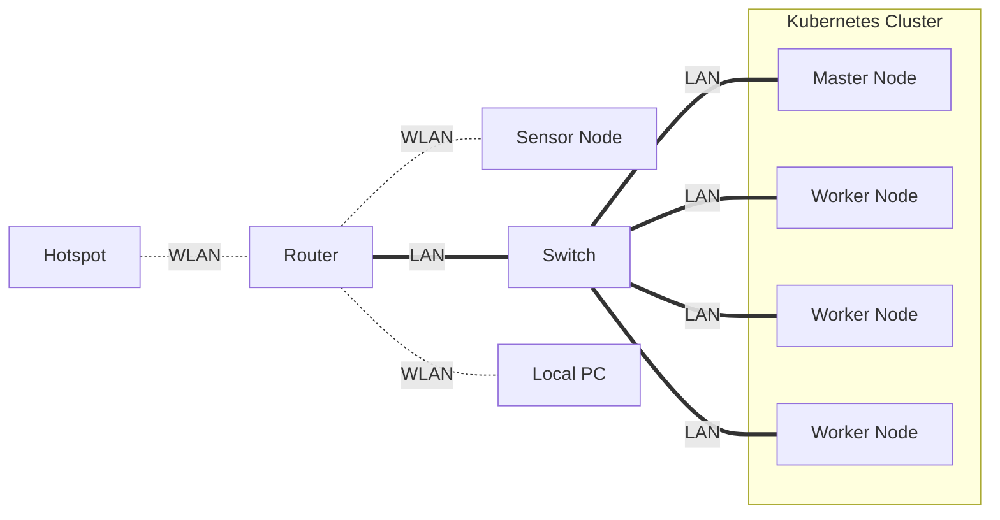
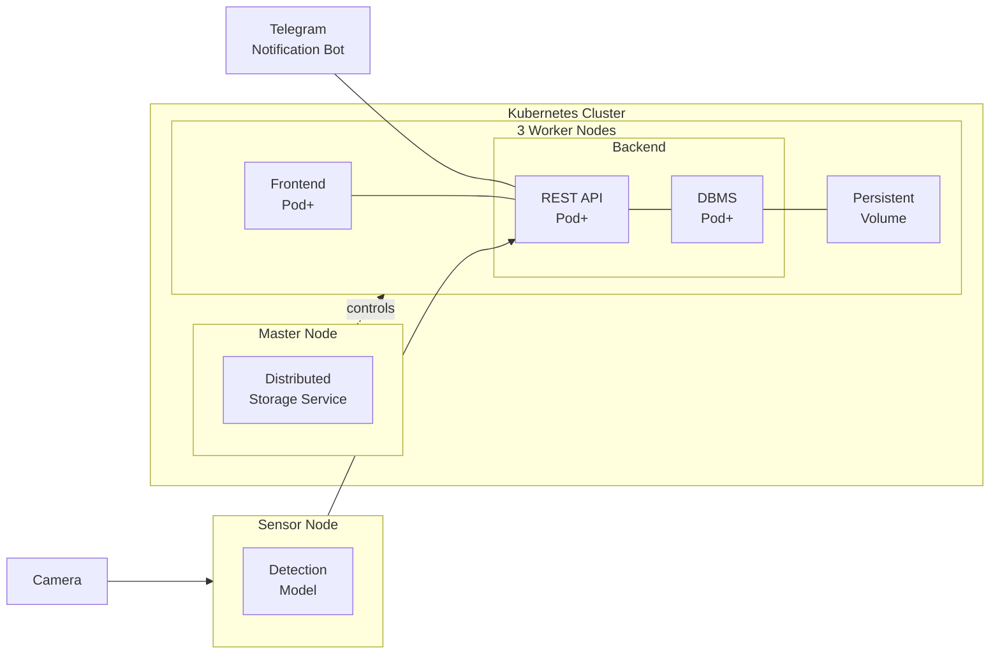
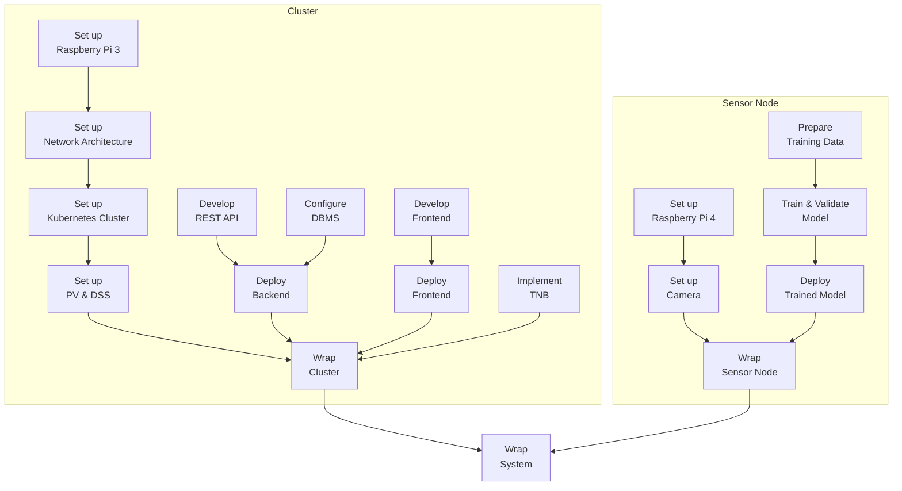

TODO: Table of contents

# Overview

**Introduction**: The project *Automatic Pet Detection With Edge Computing* is part of the Cloud Computing SS23 module of Prof. Dr. Christian Baun at the Frankfurt University of Applied Sciences. Further information about the module can be found [here](https://www.christianbaun.de/CGC23/index.html).

**Objective**: This project aims to develop an edge computing solution for the automatic detection of cats and dogs. General steps to achieve the project goal are listed in the **Project Plan** part of this Overview section.

**Duration**: 12.04.2023 - 05.07.2023

**Source Code**: [Link](https://github.com/ccfrauasgr2/pet-detection/tree/main)

**Presentation Slides**: [Link](https://docs.google.com/presentation/d/1wE96Q1euAeaRYBAPP1TrVFQCkrlQES2NmLTt2wVjyIs/edit?usp=sharing)

**Hardware**:
- 1x Raspberry Pi 4 Model B
- 4x Raspberry Pi 3 Model B+
- 5x Samsung EVO Plus 32GB MicroSDHC
- 1x Apple USB-C-to-USB-C Charger
- 1x Anker 6-Port PowerPort
- 2x TP-Link TL-SG105 5-Port Desktop Switch
- 6x LAN Cable
- 4x CoolReal USB-C-to-USB-C Cable
- 1x Raspberry Pi Camera Module 2

**Network Architecture**:

**System Architecture**:

| Component                              | Role                                                                                                                                                                                |
| -------------------------------------- | ----------------------------------------------------------------------------------------------------------------------------------------------------------------------------------- |
| Camera                                 | captures visual data and sends them to the sensor node                                                                                                                              |
| Detection Model                        | analyzes visual data to detect and classify pet                                                                                                                                     |
| Persistent Volume (PV)                 | serves as the shared persistent storage resource in the cluster                                                                                                                     |
| Distributed Storage System (DSS)       | manages the underlying storage infrastructure of the persistent volume, allows concurrent read and write operations to the shared persistent volume, ensures high data availability |
| Frontend Pod+                          | provides user interface and handles user interactions, scalable                                                                                                                     |
| REST API Pod+                          | exposes endpoints to facilitate communication and data exchange between system components, scalable                                                                                 |
| Database Management System (DBMS) Pod+ | handles write and read queries for storing and retrieving detection results, scalable                                                                                               |
| Telegram Notification Bot (TNB)        | notifies user about detection results via Telegram                                                                                                                                  |

**System Behavior**:

TODO: Text description
> **_IDEA:_**
> - Live detection
> - Detect phase starts when the model detects pet for the first time (since the beginning of live detection OR after the previous detect phase ends).
> - Detect phase ends when the model no longer detects pet.
> - Telegram notifications are sent at the beginning and at the end of each detect phase.
> - The first detection result (successful pet detection) is sent right away to the cluster for Telegram notification.
> - Beside the first detection result, only subsequent detection results at 2- or 3-second intervals until the detect phase ends are sent to the cluster.
> - These detection results should be sent in batches to reduce overhead and improve efficiency. 
> - This process can be realized by using the REST API and a buffer in the sensor node: If the buffer reaches a certain size or timer, the detection results are sent to the REST API in the sensor node in batches. When the detect phase ends, any remaining results in the buffer are also sent to the REST API in the sensor node in batches.
> - The REST API containers in the cluster receive the detection results and store them in the persistent volume.
> - The frontend containers on the worker nodes periodically query the REST API containers for any new detected pets and display them.

Telegram message when detect phase starts:

`A wild Pikachu appeared!` (LOL - Just kidding)

`<ANIMAL_TYPES> detected at <START_TIME> on <DATE>`

`<PHOTO_WITH_BOUNDING_BOXES_&_ANIMAL_TYPES_&_CONF_VALUE>`

Telegram message when detect phase ends: 

`In <DURATION> seconds from <START_TIME> to <END_TIME> on <DATE>: <ANIMAL_TYPEs> were detected, X pictures were taken, and the highest confidence value is <HIGHEST_CONF_VALUE> `

**Project Plan**:

**Group 2 Info & Task Distribution**:

| Member              | MatrNr. | Uni-Mail                            | Tasks                                                                                                                  |
| ------------------- | ------- | ----------------------------------- | ---------------------------------------------------------------------------------------------------------------------- |
| Vincent Roßknecht   | 1471764 | vincent.rossknecht@stud.fra-uas.de  | Prepare Training Data Train & Validate Model                                                                       |
| Jonas Hülsmann      | 1482889 | jonas.huelsman@stud.fra-uas.de      | Set up Raspberry 3 Set up Kubernetes Cluster Develop REST API Implement TNB                                |
| Marco Tenderra      | 1251463 | tenderra@stud.fra-uas.de            | Set up Network Architecture Set up Raspberry 4 Set up Camera Prepare Training Data Develop REST API    |
| Minh Kien Nguyen    | 1434361 | minh.nguyen4@stud.fra-uas.de        | Set up Raspberry 3 Set up Network Architecture Set up Kubernetes Cluster Set up PV & DSS Implement TNB |
| Alexander Atanassov | 1221846 | alexander.atanassov@stud.fra-uas.de | Develop Frontend Develop REST API                                                                                  |

# Sensor Node

## Set up Raspberry Pi 4
- Insert an empty SD-Card into local PC
- Install then run [Raspberry Pi Imager](https://www.raspberrypi.com/software/) on local PC
- In the Raspberry Pi Imager:
  - For Operating System, select `Raspberry Pi OS Lite (32-bit)`
  - For Storage, select the inserted SD-Card
  - In Advanced options (Cog icon):
    - Set `pi0` as hostname
    - Set `admin` as username and set own password
    - Enable `Enable SSH` and `Use password authentication` options. This allows for remote access and control of Raspberry Pi 4 via SSH from local PC. 
    - Enable `Configure wireless LAN` option, select then type in specific values for the SSID and password so that Raspberry Pi 4 will automatically connect to the system network. It is recommended to write down the SSID and password as they will be used later in [Set up Network Architecture](#set-up-network-architecture).
    - To save the above advance options for further use, set Image customization options to `to always use`
  - Write to SD-Card
- [Connect](https://projects.raspberrypi.org/en/projects/raspberry-pi-setting-up/3) and [Start up](https://projects.raspberrypi.org/en/projects/raspberry-pi-setting-up/4) Raspberry Pi 4 with SD-Card
- [SSH into Raspberry Pi](https://www.makeuseof.com/how-to-ssh-into-raspberry-pi-remote/#:~:text=SSH%20Into%20Raspberry%20Pi%20From%20Windows&text=In%20the%20PuTTY%20dialog%2C%20select,the%20connection%20details%20in%20PuTTY.) 4 from local PC with the command `ssh admin@pi0.local`
- Update system packages with `sudo apt update` then `sudo apt upgrade -y`  
- SSH only provides *terminal* access to Raspberry Pi 4. To *remotely control the desktop interface* of Raspberry Pi 4, we use VNC (Virtual Network Computing). To enable VNC connection:
  - First, enable VNC Server on Raspberry Pi 4. SSH into Raspberry Pi 4 from local PC, then enter `sudo raspi-config`. Now with the arrows select `Interfacing Options`, navigate to `VNC`, choose `Yes`, and select `Ok`.
  - Install [Real VNC Viewer](https://www.realvnc.com/en/connect/download/viewer/) on local PC
  - Open local VNC Viewer, enter `pi0.local:0` or `[IP address of Raspberry Pi 4]`. To find the IP address of Raspberry Pi 4, SSH into Raspberry Pi 4 from local PC, then enter `hostname -I`.
  - Enter login credentials that were set while configuring Raspberry Pi Imager.
  - The VNC session should start, and the Raspberry Pi desktop should be available.

## Set up Camera

- To connect Raspberry Pi Camera Module 2 to Raspberry Pi 4, follow the steps listed in [Connect the Camera Module](https://projects.raspberrypi.org/en/projects/getting-started-with-picamera/2). Make sure the Camera Module faces the USB and Ethernet ports.
- To test if the connection is working, enter `libcamera-still -o test.jpg` to capture a single image. For more information about `libcamera-still`, refer to [this documentation](https://www.raspberrypi.com/documentation/computers/camera_software.html#libcamera-and-libcamera-apps).

## Prepare Training Data

## Train & Validate Model

## Deploy Trained Model

## Wrap Sensor Node

# Cluster

## Set up Raspberry Pi 3

- Follow the steps listed in [Set up Raspberry Pi 4](#set-up-raspberry-pi-4)
- For Operating System, select `Raspberry Pi OS Lite (64-bit)`
- Set `pi[1|2|3|4]` as hostname for each of four available Raspberry Pi 3

## Set up Network Architecture

## Set up Kubernetes Cluster

## Set up PV & DSS

## Develop REST API

## Configure DBMS

## Deploy Backend

## Develop Frontend

## Deploy Frontend

## Implement TNB

## Wrap Cluster

