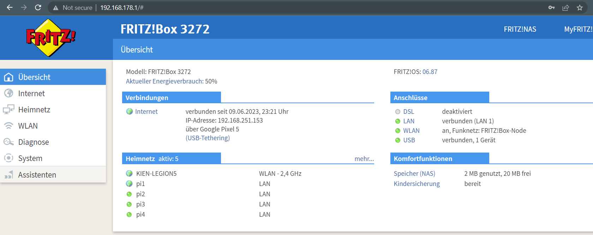

TODO: Table of contents

# Overview

**Introduction**: The project *Automatic Pet Detection With Edge Computing* is part of the Cloud Computing SS23 module of Prof. Dr. Christian Baun at the Frankfurt University of Applied Sciences. Further information about the module can be found [here](https://www.christianbaun.de/CGC23/index.html).

**Objective**: This project aims to develop an edge computing solution for the automatic detection of cats and dogs. General steps to achieve the project goal are listed in the **Project Plan** part of this Overview section.

**Duration**: 12.04.2023 - 05.07.2023

**Source Code**: [Link](https://github.com/ccfrauasgr2/pet-detection/tree/main)

**Presentation Slides**: [Link](https://docs.google.com/presentation/d/1wE96Q1euAeaRYBAPP1TrVFQCkrlQES2NmLTt2wVjyIs/edit?usp=sharing)

**Hardware**:

Received from Prof.:

- 1x Raspberry Pi 4 Model B (Pi 4B)
- 1x Raspberry Pi 3 Model B+ (Pi 3B+)
- 3x Raspberry Pi 3 Model B V1.2 (Pi 3B)
- 5x Samsung EVO Plus 32GB MicroSDHC
- 1x Apple USB-C-to-USB-C Charger
- 1x Anker 6-Port PowerPort
- 2x TP-Link TL-SG105 5-Port Desktop Switch
- 6x LAN Cable
- 4x CoolReal USB-C-to-USB-C Cable
- 1x Raspberry Pi Camera Module 2 (Camera Module)

Obtained from own source:

- 1x FRITZ!Box 3272 Router
- 1x USB-to-USB-C Cable
- 1x ISY ICR-120 Micro-SDHC Reader

**Network Architecture**:


**System Architecture**:


| Component                       | Role                                                                                                                                     |
| ------------------------------- | ---------------------------------------------------------------------------------------------------------------------------------------- |
| Camera                          | - capture visual data<br>- send visual data to the sensor node                                                                           |
| Detection Model                 | analyze visual data to detect & classify pet                                                                                             |
| Persistent Volume (PV)          | - serve as persistent storage resource in the cluster<br>- base on local storage available on worker nodes                               |
| Storage Service                 | - dynamically provision PV<br>- manage the underlying storage infrastructure of PV<br>- synchronize & replicate data across worker nodes |
| Frontend Pods                   | - provide user interface<br>- handle user interactions                                                                                   |
| REST API Pods                   | expose endpoints to facilitate communication & data exchange between system components                                                   |
| Database System (DBS) Pods      | - handle read & write queries for retrieving & storing detection results<br>- synchronize & replicate data across pods                   |
| Telegram Notification Bot (TNB) | notify user about detection results via Telegram                                                                                         |
| Local PC                        | serve as tool for setting up system                                                                                                      |


**System Behavior**:

TODO: Text description
> **_IDEA:_**
> - Live detection
> - Detect phase starts when the model detects pet for the first time (since the beginning of live detection OR after the previous detect phase ends).
> - Detect phase ends when the model no longer detects pet.
> - Telegram notifications are sent at the beginning and at the end of each detect phase.
> - The first detection result (successful pet detection) is sent right away to the cluster for Telegram notification.
> - Beside the first detection result, only subsequent detection results at 2- or 3-second intervals until the detect phase ends are sent to the cluster.
> - These detection results should be sent in batches to reduce overhead and improve efficiency. 
> - This process can be realized by using the REST API and a buffer in the sensor node: If the buffer reaches a certain size or timer, the detection results are sent to the REST API in the sensor node in batches. When the detect phase ends, any remaining results in the buffer are also sent to the REST API in the sensor node in batches.
> - The REST API containers in the cluster receive the detection results and store them in the persistent volume.
> - The frontend containers on the worker nodes periodically query the REST API containers for any new detected pets and display them.

Telegram message when detect phase starts:

`A wild Pikachu appeared!` (LOL - Just kidding)

`<ANIMAL_TYPES> detected at <START_TIME> on <DATE>`

`<PHOTO_WITH_BOUNDING_BOXES_&_ANIMAL_TYPES_&_CONF_VALUE>`

Telegram message when detect phase ends: 

`In <DURATION> seconds from <START_TIME> to <END_TIME> on <DATE>: <ANIMAL_TYPEs> were detected, X pictures were taken, and the highest confidence value is <HIGHEST_CONF_VALUE> `

**Kubernetes Architecture:**

TODO

**Project Plan**:


**Group 2 Info & Task Distribution**:

| Member              | MatrNr. | Uni-Mail                            | Tasks                                                                                                                             |
| ------------------- | ------- | ----------------------------------- | --------------------------------------------------------------------------------------------------------------------------------- |
| Vincent Roßknecht   | 1471764 | vincent.rossknecht@stud.fra-uas.de  | Prepare Training Data<br/>Train & Validate Model                                                                                  |
| Jonas Hülsmann      | 1482889 | jonas.huelsman@stud.fra-uas.de      | Develop REST API<br/>Set up DBS<br/>Implement TNB                                                                                 |
| Marco Tenderra      | 1251463 | tenderra@stud.fra-uas.de            | Set up Pi 4B<br/>Set up Camera<br/>Prepare Training Data<br/>Develop REST API                                                     |
| Minh Kien Nguyen    | 1434361 | minh.nguyen4@stud.fra-uas.de        | Set up Pi 3B & 3B+<br/>Set up Static IP<br/>Set up Kubernetes Cluster<br/>Set up Storage Service<br/>Set up DBS<br/>Implement TNB |
| Alexander Atanassov | 1221846 | alexander.atanassov@stud.fra-uas.de | Develop Frontend<br/>Develop REST API                                                                                             |


# Sensor Node

## Set up Pi 4B
- Insert an empty SD-Card into local PC.
- Install then run [Raspberry Pi Imager](https://www.raspberrypi.com/software/) on local PC.
- In the Raspberry Pi Imager:
  - For Operating System, select `Raspberry Pi OS (64-bit)`.
  - For Storage, select the inserted SD-Card.
  - In Advanced options (Cog icon):
    - Set `pi0` as hostname.
    - Set `admin` as username and set own password.
    - Enable `Enable SSH` and `Use password authentication` options. This allows for remote access and control of Pi 4B via SSH from local PC. 
    - Enable `Configure wireless LAN` option, type in the SSID and password of the router so that Pi 4B will automatically connect to the router network.
    - To save the above advance options for further use, set Image customization options to `to always use`.
  - Write to SD-Card.
- [Connect](https://projects.raspberrypi.org/en/projects/raspberry-pi-setting-up/3) and [Start up](https://projects.raspberrypi.org/en/projects/raspberry-pi-setting-up/4) Pi 4B with SD-Card.
- [SSH into](https://www.makeuseof.com/how-to-ssh-into-raspberry-pi-remote/#:~:text=SSH%20Into%20Raspberry%20Pi%20From%20Windows&text=In%20the%20PuTTY%20dialog%2C%20select,the%20connection%20details%20in%20PuTTY.) Pi 4B from local PC with the command `ssh admin@pi0.local`
- Update system packages with `sudo apt update` then `sudo apt upgrade -y`  
- SSH only provides *terminal* access to Pi 4B. To *remotely control the desktop interface* of Pi 4B, we use VNC (Virtual Network Computing). To enable VNC connection:
  - First, enable VNC Server on Pi 4B. SSH into Pi 4B from local PC, then enter `sudo raspi-config`. Now with the arrows select `Interfacing Options`, navigate to `VNC`, choose `Yes`, and select `Ok`.
  - Install [Real VNC Viewer](https://www.realvnc.com/en/connect/download/viewer/) on local PC.
  - Open local VNC Viewer, enter `pi0.local:0` or `[IP address of Pi 4B]`. To find the IP address of Pi 4B, SSH into Pi 4B from local PC, then enter `hostname -I`.
  - Enter login credentials that were set while configuring Raspberry Pi Imager.
  - The VNC session should start, and the Raspberry Pi desktop should be available.

## Set up Camera

- To connect Camera Module to Pi 4B, follow the steps listed in [Connect the Camera Module](https://projects.raspberrypi.org/en/projects/getting-started-with-picamera/2). Make sure the Camera Module faces the USB and Ethernet ports.
- To test if the connection is working, enter `libcamera-still -o test.jpg` to capture a single image. For more information about `libcamera-still`, refer to [this documentation](https://www.raspberrypi.com/documentation/computers/camera_software.html#libcamera-and-libcamera-apps).

## Prepare Training Data

## Train & Validate Model

## Deploy Trained Model

## Test Sensor Node

# Cluster

## Set up Pi 3B & 3B+

- Follow the steps listed in [Set up Pi 4B](#set-up-pi-4b), but disable `Configure wireless LAN` option, and **DO NOT SSH into each Pi 3 yet!** Do that after [Set up Static IP](#set-up-static-ip) is done.
- For Operating System, select `Raspberry Pi OS Lite (64-bit)`.
- Set `pi1` as hostname for Pi 3B+, and `pi2`, `pi3`, `pi4` as hostname for each of three available Pi 3B.

## Set up Static IP

For a Kubernetes cluster to work, the worker nodes must know the IP address of the master (controller) node and vice versa, so that they can communicate with each other. If the nodes' IP addresses change during communication, the Kubernetes cluster won't work. It is therefore critical that the master and worker nodes be assigned static (fixed) IP addresses. For that purpose, we use an additional FRITZ!Box Router. Here are the steps to set up static IP addresses:

- Turn on all hardware shown in the Network Architecture part of the [Overview section](#overview).
- Share the hotspot device's internet connection with the router through USB-Tethering.
- Connect local PC and all Pi with the router network.
- On local PC, enter `ipconfig` on Command Prompt (in Windows) and look for the Default Gateway IP address of the router network (`192.168.178.1` in our case).
- Still on local PC, enter the IP address just found in a browser to open the router (FRITZ!Box) user interface (see below image; `KIEN-LEGION5` and `Google Pixel 5` were the local PC and hotspot device used, respectively).

  

- [Assign static IP addresses to all available Pi](https://www.giga.de/hardware/avm-fritz-box-fon-wlan-7390/tipps/fritzbox-feste-ip-vergeben-so-geht-s/), then restart all Pi.

  | Raspberry Pi | Assigned IP Address | Connection |
  | ------------ | ------------------- | ---------- |
  | ``pi1``      | `192.168.178.61`    | LAN        |
  | ``pi2``      | `192.168.178.62`    | LAN        |
  | ``pi3``      | `192.168.178.63`    | LAN        |
  | ``pi4``      | `192.168.178.64`    | LAN        |
- To check if the setup works, restart hotspot device, then share its internet connection again. All Pi should still have the same static IP addresses assigned to them.
  
  
  

After setting up static IP, for convenience we will enable passwordless, SSH-key-based login from local PC to each Pi 3:

- First, generate SSH key on local PC with:

  ```
  # Do not fill anything when asked, just hit "Enter"
  ssh-keygen -t rsa -b 2048
  # Public key location: "~/.ssh/id_rsa.pub" (on Windows; "~" denotes home directory)
  ```
- Then, copy the generated SSH key to each Pi 3 and finish setting them up. Do the following for each Pi 3:

  ```
  # SSH into Pi 3, make sure you are user <admin>
  # E.g., on local PC:
  ssh admin@pi1.local

  # Once logged in, go to <admin>'s home directory and create directory ".ssh"
  cd
  mkdir -p ~/.ssh

  # Open new file "authorized_keys" in the ".ssh" directory
  sudo nano ~/.ssh/authorized_keys
  # Paste the contents of the public key "id_rsa.pub" into this file. 
  # Hit "Ctrl" + "X" -> "Y" -> "Enter" to save changes.

  # Update system packages
  sudo apt update && sudo apt upgrade -y

  # Disable IPv6 & enable memory cgroup
  sudo nano /boot/cmdline.txt
  # Append "ipv6.disable=1 cgroup_memory=1 cgroup_enable=memory" at the end of the first line. 
  # It is important that there is no line break added.
  # Hit "Ctrl" + "X" -> "Y" -> "Enter" to save changes.

  # Reboot Pi 3 so all changes thus far take place.
  sudo reboot
  ```

## Set up Kubernetes Cluster

There are three possible designs for the Kubernetes cluster:

| Design                | Pros                                                                                                                         | Cons                                                                                                                | Decision |
| --------------------- | ---------------------------------------------------------------------------------------------------------------------------- | ------------------------------------------------------------------------------------------------------------------- | -------- |
| 1 Master & 3 Workers  | - Simple setup<br>- Enables fault tolerance & high availability in worker plane<br>- Enables scalability across worker nodes | No fault tolerance & high availability in control plane                                                             | Adopt    |
| 2 Masters & 2 Workers | - Enables fault tolerance & high availability in both control & worker planes<br>- Enables scalability across worker nodes   | Complex setup                                                                                                       | Discard  |
| 3 Masters & 1 Worker  | Enables fault tolerance & high availability in control plane                                                                 | - No fault tolerance & high availability in worker plane<br>- Complex setup<br>- No scalability across worker nodes | Discard  |

We prioritize *setup complexity* ``>`` *high availability & fault tolerance* ``>`` *scalability*, which is why we adopt the first design. Our Kubenetes cluster now consists of `pi1` as master node and `pi2, pi3, pi4` as worker nodes. 

Given the hardware specifications of all Pi 3, it is best to set them up as a [`K3s`](https://docs.k3s.io/) cluster. However, huge CPU and MEM usage (100~300% and >65%, respectively) by `k3s-server` on fresh install  made the master node barely respond to any command. The [workarounds](https://docs.k3s.io/advanced#old-iptables-versions) suggested in `K3s` documentation did not alleviate the problem for us. Hence, instead of `K3s`, we used [`K0s`](https://docs.k0sproject.io/v1.27.2+k0s.0/). Here are the steps to set up set up a `K0s` cluster:

- On `pi1` (the designated master node):
  - Run `curl -sSLf https://get.k0s.sh | sudo sh` to download the latest stable `K0s`.
  - Run the following commands to deploy as master (controller) node:

    ```
    # Install, start, and check the k0scontroller service
    sudo k0s install controller
    sudo systemctl start k0scontroller.service
    systemctl status k0scontroller.service
    ```
  - Create a token with which new worker nodes can join the `K0s` cluster by `pi1`. Save the join token for subsequent steps.

    ```
    sudo k0s token create --role worker
    ```
- On each `pi2`, `pi3`, and `pi4` (the designated worker nodes):
  - Run `curl -sSLf https://get.k0s.sh | sudo sh` to download the latest stable `K0s`.
  - Run the following commands to deploy as worker node:
    
    ```
    # To join the K0s cluster by pi1, create the join token file for the worker
    # $TOKEN_CONTENT is the join token created by pi1:
    sudo sh -c 'mkdir -p /var/lib/k0s/ && umask 077 && echo "$TOKEN_CONTENT" > /var/lib/k0s/join-token'

    # Install, start, and check the k0sworker service
    sudo k0s install worker --token-file /var/lib/k0s/join-token
    sudo systemctl start k0sworker.service
    systemctl status k0sworker.service
    sudo k0s status
    ```
- Run `sudo k0s kc get nodes` on `pi1` to verify if the whole setup works. [Note that `pi1` is not shown, because by default `K0s` only lists nodes with workloads, i.e., worker nodes.](https://docs.k0sproject.io/v1.27.2+k0s.0/FAQ/?h=show+controller#why-doesnt-kubectl-get-nodes-list-the-k0s-controllers)
  
  

For convenience we will install `Helm` and configure ``kubectl`` on local PC. ``Helm`` is the package manager for Kubernetes, and `kubectl` is the Kubernetes command-line tool that allows us to run commands against Kubernetes clusters.
  - [This guide](https://helm.sh/docs/intro/install/#from-the-binary-releases) shows how to install `Helm` on local PC.
  - [This guide](https://kubernetes.io/docs/tasks/tools/) shows how to install `kubectl` on local PC.
  - To configure `kubectl` on local PC, open the file `/var/lib/k0s/pki/admin.conf` on `pi1` with `sudo cat /var/lib/k0s/pki/admin.conf` and copy its content.
  - Paste the copied content in the `config` file normally available at `~/.kube/config` (`~` denotes home directory on local PC; if `.kube/config` is unavailable, create one). Here it is crucial to replace ``localhost`` in `clusters:cluster:server` with the static IP address of the master node (`192.168.178.61`). Everything else can stay the same. 

    ```
    apiVersion: v1
    clusters:
    - cluster:
        certificate-authority-data: ...
        server: https://192.168.178.61:6443
    ...
    ```
  - Now we can access the setup `K0s` cluster from local PC. For example:
    
     

As preparation for future tasks we will install and configure [``MetalLB``](https://metallb.universe.tf/) on our `K0s` cluster. ``MetalLB`` simplifies the process of using ``LoadBalancer`` services in our `K0s` cluster by providing IP address allocation and load balancing capabilities, making it easier to expose Kubernetes services externally.

- First, install `MetalLB`:

  ```
  # Add metallb repository to helm
  helm repo add metallb https://metallb.github.io/metallb

  # Install metallb
  helm upgrade --install metallb metallb/metallb --create-namespace --namespace metallb-system --wait
  ```
  Expected installation result:

  

- Then, [configure](https://metallb.universe.tf/configuration/) `MetalLB` by applying this [`metallb.yaml`-script](https://github.com/ccfrauasgr2/pet-detection/blob/main/scripts/metallb/metallb.yaml). In the script we specify the IP address pool that `MetalLB` can use to assign to Kubernetes services of type ``LoadBalancer`` (from ``192.168.178.200`` to ``192.168.178.220``), allowing these service to be accessible from outside the cluster.

  ```
  # On local PC, change directory to script location, then
  kubectl apply -f metallb.yaml
  ```
  Expected configuration result:
  ```
  ipaddresspool.metallb.io/default-pool created
  l2advertisement.metallb.io/default created
  ```

## Set up Storage Service

In the beginning, we decided to use [``Longhorn``](https://longhorn.io/docs/1.4.2/what-is-longhorn/) as Storage Service. A comparison between ``Longhorn`` and several other storage services can be found [here](https://rpi4cluster.com/k3s/k3s-storage-setting/). In summary, ``Longhorn`` excels in its lightweight nature and suitability for meeting the project's needs in terms of scalability, high availability, and high I/O performance. However, after installation our `Longhorn` pods were in constant `CrashLoopBackOff` status. That, coupled with the complex setup and usage, made us abandon `Longhorn`. 

Now with ease of setup as high priority, we turned to [`OpenEBS`](https://openebs.io/docs#what-is-openebs) for Storage Service instead. ``OpenEBS`` uses the storage available on Kubernetes worker nodes to provide Stateful(Set) workloads with [Replicated Volumes](https://openebs.io/docs/#what-does-openebs-do), which ensure high availability and fault tolerance for data on our `K0s` cluster. Due to hardware limitation, we could only use [`OpenEBS Jiva Operator`](https://github.com/openebs/jiva-operator#jiva-operator) for the provision.

How does the ``Jiva Operator`` provide Stateful workloads with Replicated Volumes? Here is the typical workflow:

1. We create a Persistent Volume Claim (PVC) and specify in it requirements about storage class, storage capacity, and access mode.
2. The `Jiva Operator` automatically provisions a new *Jiva Volume* or selects an already provisioned one that matches the PVC's requirements. Jiva Volumes are what the ``Jiva Operator`` call its Replicated Volumes that operate at block level.
3. Once the `Jiva Operator` identifies a suitable Jiva Volume, the PVC is bound to that volume. At this point, the PVC status changes to "Bound," indicating a successful association between the PVC and the Jiva Volume.
4. The bound PVC can be used in Kubernetes pod configurations to provide persistent storage, and any data written to the PVC will be stored on the associated Jiva volume.

Now, we will configure the ``Jiva Operator`` (`OpenEBS`) to dynamically provisions Jiva Volumes (Persistent Volumes) for Stateful workloads (DBS Pods). The following configuration steps are based on [`OpenEBS Jiva Operator`'s quickstart guide](https://github.com/openebs/jiva-operator/blob/0b3ead63dffddd36c80a4ba8de5a24a470cd6feb/docs/quickstart.md):

- Ensure package `open-iscsi` (`iSCSI`) is installed on each worker node:
  
  ```
  # Commands to install open-iscsi
  sudo apt install open-iscsi
  sudo systemctl enable --now iscsid
  modprobe iscsi_tcp

  # Verify iSCSI Status, should be active (running)
  sudo systemctl status iscsid.service
  ```

- Ensure the `K0s` cluster has ``OpenEBS`` localpv-hostpath version ``2.6.0`` or higher:
  
  ```
  # Run this command on local PC
  kubectl apply -f https://openebs.github.io/charts/hostpath-operator.yaml
  ```

- Install `OpenEBS Jiva Operator` with `Helm`:
  ```
  # Get repo info
  helm repo add openebs-jiva https://openebs.github.io/jiva-operator
  helm repo update

  # Install
  helm install openebs-jiva openebs-jiva/jiva --namespace openebs --create-namespace
  ```
  Expected installation results:

  

  

- Apply the scripts listed [here](https://github.com/ccfrauasgr2/pet-detection/tree/main/scripts/jiva):
  - The script `jivaVolumePolicy.yaml` creates a Jiva Volume Policy in which various policies for provisioning Jiva Volumes are declared. The policies declared in this script are [Replica STS Pod Anti-Affinity](https://github.com/openebs/jiva-operator/blob/0b3ead63dffddd36c80a4ba8de5a24a470cd6feb/docs/tutorials/policies.md#replica-sts-pod-anti-affinity) and [Target Pod Affinity](https://github.com/openebs/jiva-operator/blob/0b3ead63dffddd36c80a4ba8de5a24a470cd6feb/docs/tutorials/policies.md#target-pod-affinity).

    ```
    kubectl apply -f jivaVolumePolicy.yaml
    ```
  - The script `jivaStorageClass.yaml` creates a Storage Class that dynamically provisions Jira Volumes with the declared policies:
    
    ```
    kubectl apply -f jivaStorageClass.yaml
    ```
  - The script `jivaPVC.yaml` creates a PVC that requires/uses the above Storage Class:
    
    ```
    kubectl apply -f jivaPVC.yaml
    ```
  - The next step is to deploy a DBS application using this PVC; we will do that in the next section. For now check the PVC we just created:
    
    

## Set up DBS


```
kubectl apply -f couchdbSecret.yaml
kubectl apply -f couchdbConfig.yaml
kubectl apply -f couchdb.yaml
```

## Develop REST API

## Deploy Backend

## Develop Frontend

## Deploy Frontend

## Implement TNB

## Test Cluster


