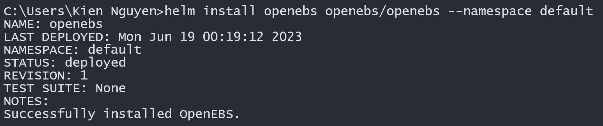
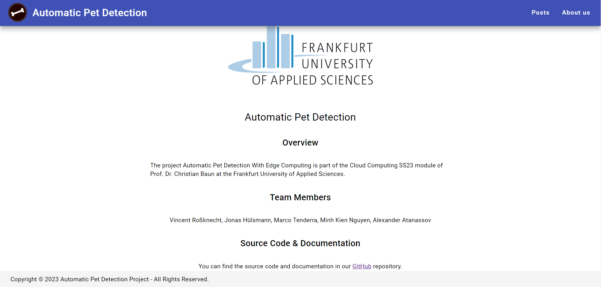

<br>
<br>

<div style="text-align: center;">
  
</div>

<br>
<br>
<br>

<div style="text-align: center;">
  <font size="4"><strong>Project Report</strong></font>
</div>

<br>
<br>
<br>

<div style="text-align: center;">
  <font size="6.9">Automatic Pet Detection</font>
</div>
<br>
<div style="text-align: center;">
  <font size="6.9">With Edge Computing</font>
</div>

<br>
<br>
<br>

<div style="text-align: center;">
  <font size="3"><em>by</em></font>
</div>
<br>
<br>
<div style="text-align: center;">
  <font size="3"><strong>Group 2</strong></font>
  <br>
  <font size="4">Vincent Roßknecht</font>
  <br>
  <font size="4">Jonas Hülsmann</font>
  <br>
  <font size="4">Marco Tenderra</font>
  <br>
  <font size="4">Minh Kien Nguyen</font>
  <br>
  <font size="4">Alexander Atanassov</font>
</div>

<br>
<br>

<div style="text-align: center;">
  <font size="3"><strong>Supervisor</strong></font>
  <br>
  <font size="4">Prof. Dr. Christian Baun</font>
</div>

<br>
<br>

<div style="text-align: center;">
  <font size="3"><strong>Submission Date</strong></font>
  <br>
  <font size="4">July 14th, 2023</font>
</div>


<div style="page-break-after: always"></div>

**Table of Contents**

- [Overview](#overview)
- [Sensor Node](#sensor-node)
  - [Set up Pi 4B](#set-up-pi-4b)
  - [Set up Camera](#set-up-camera)
  - [Prepare Training Data](#prepare-training-data)
  - [Train \& Test Model](#train--test-model)
  - [Develop \& Deploy Application](#develop--deploy-application)
- [Cluster](#cluster)
  - [Set up Pi 3B \& 3B+](#set-up-pi-3b--3b)
  - [Set up Static IP](#set-up-static-ip)
  - [Set up Kubernetes Cluster](#set-up-kubernetes-cluster)
  - [Set up Storage Service](#set-up-storage-service)
  - [Set up DBS](#set-up-dbs)
  - [Implement TNB](#implement-tnb)
  - [Develop REST API](#develop-rest-api)
  - [Deploy Backend](#deploy-backend)
  - [Develop Frontend](#develop-frontend)
  - [Deploy Frontend](#deploy-frontend)
- [Test System](#test-system)
  - [Test TNB](#test-tnb)
  - [Test Main Functionality](#test-main-functionality)
  - [Test High Availability DBS](#test-high-availability-dbs)

<div style="page-break-after: always"></div>

# Overview

**Introduction**: The project *Automatic Pet Detection With Edge Computing* is part of the [Cloud Computing SS23 module](https://www.christianbaun.de/CGC23/index.html) of Prof. Dr. Christian Baun at the Frankfurt University of Applied Sciences.

**Objective**: This project aims to develop an edge computing solution for the automatic detection of cats and dogs. General steps to achieve the project goal are listed in the **Project Plan** part of this Overview section.

**Duration**: 12.04.2023 - 05.07.2023

**Source Code**: [Link](https://github.com/ccfrauasgr2/pet-detection/tree/main)

**Presentation Slides**: [Link](https://docs.google.com/presentation/d/1wE96Q1euAeaRYBAPP1TrVFQCkrlQES2NmLTt2wVjyIs/edit?usp=sharing)

**Hardware**:

| Received from Prof.                                                                                                                                                                                                                                                                                                                                                 | Obtained from own source                                                               |
| ------------------------------------------------------------------------------------------------------------------------------------------------------------------------------------------------------------------------------------------------------------------------------------------------------------------------------------------------------------------- | -------------------------------------------------------------------------------------- |
| 1x Raspberry Pi 4 Model B (Pi 4B)<br>1x Raspberry Pi 3 Model B+ (Pi 3B+)<br>3x Raspberry Pi 3 Model B V1.2 (Pi 3B)<br>5x Samsung 32GB MicroSDHC<br>1x Apple USB-C-to-USB-C Charger<br>1x Anker 6-Port PowerPort<br>2x TP-Link TL-SG105 5-Port Desktop Switch<br>6x LAN Cable<br>4x CoolReal USB-C-to-USB-C Cable<br>1x Raspberry Pi Camera Module 2 (Camera Module) | 1x FRITZ!Box 3272 Router<br>1x USB-to-USB-C Cable<br>1x ISY ICR-120 8-in-1 Card Reader |

**System Architecture**:


<div style="page-break-after: always"></div>

| Component                       | Role                                                                                                                                                           |
| ------------------------------- | -------------------------------------------------------------------------------------------------------------------------------------------------------------- |
| Camera                          | capture and send visual data to the sensor node                                                                                                                |
| Application                     | - analyze visual data for pet detection<br>- process and pack pet image & detection results into JSON format<br>- send JSON data to the cluster                |
| Persistent Volumes (PV)         | - serve as persistent storage resource in the cluster<br>- use local storage available on worker nodes                                                         |
| Storage Service                 | - dynamically provision PV<br>- manage the underlying storage infrastructure of PV                                                                             |
| Frontend Pods                   | - provide user interface<br>- handle user interactions                                                                                                         |
| REST API Pods                   | process data to facilitate data communication between system components                                                                                        |
| Database (DBS) Pods             | - handle read- and write-requests (queries) for detection results<br>- synchronize & replicate data across pods/worker nodes (Master-slave replication in DBS) |
| Telegram Notification Bot (TNB) | notify user about detection results via Telegram                                                                                                               |
| Local PC                        | serve as tool for setting up system                                                                                                                            |

**System Behavior**: See [Test System](#test-system) section.

**Network Architecture**:


**Kubernetes Architecture:**


**Project Plan**:


<div style="page-break-after: always"></div>

**Group 2 Info & Task Distribution**:

| Member<br>MatrNr.                 | Uni-Mail                            | Primary<br>Tasks                                                                                                                              | Secondary<br>Tasks                                       |
| --------------------------------- | ----------------------------------- | --------------------------------------------------------------------------------------------------------------------------------------------- | -------------------------------------------------------- |
| Vincent<br>Roßknecht<br>1471764   | vincent.rossknecht@stud.fra-uas.de  | - Prepare Training Data<br/>- Train & Test Model<br/>- Test System                                                                            |                                                          |
| Jonas<br>Hülsmann<br>1482889      | jonas.huelsman@stud.fra-uas.de      | - Develop REST API<br/>- Deploy Backend                                                                                                       | - Test System                                            |
| Marco<br>Tenderra<br>1251463      | tenderra@stud.fra-uas.de            | - Set up Pi 4B<br/>- Set up Camera<br/>- Prepare Training Data<br>- Develop & Deploy Application                                              | - Develop REST API<br>- Test System                      |
| Minh Kien<br>Nguyen<br>1434361    | minh.nguyen4@stud.fra-uas.de        | - Set up Pi 3B & 3B+<br/>- Set up Static IP<br/>- Set up Kubernetes Cluster<br/>- Set up Storage Service<br/>- Set up DBS<br/>- Implement TNB | - Deploy Backend<br/>- Deploy Frontend<br/>- Test System |
| Alexander<br>Atanassov<br>1221846 | alexander.atanassov@stud.fra-uas.de | - Develop Frontend<br/>- Deploy Frontend                                                                                                      | - Develop REST API<br>- Test System                      |
<div style="page-break-after: always"></div>

# Sensor Node

## Set up Pi 4B
- Insert an empty SD-Card into local PC.
- Install then run [Raspberry Pi Imager](https://www.raspberrypi.com/software/) on local PC.
- In the Raspberry Pi Imager:
  - For Operating System, select `Raspberry Pi OS (64-bit)`.
  - For Storage, select the inserted SD-Card.
  - In Advanced options (Cog icon):
    - Set `pi0` as hostname.
    - Set `admin` as username and set own password.
    - Enable `Enable SSH` and `Use password authentication` options. This allows for remote access and control of Pi 4B via SSH from local PC. 
    - Enable `Configure wireless LAN` option, type in the SSID and password of the router so that Pi 4B will automatically connect to the router network.
    - To save the above advance options for further use, set Image customization options to `to always use`.
  - Write to SD-Card.
- [Connect](https://projects.raspberrypi.org/en/projects/raspberry-pi-setting-up/3) and [Start up](https://projects.raspberrypi.org/en/projects/raspberry-pi-setting-up/4) Pi 4B with SD-Card.
- [SSH into](https://www.makeuseof.com/how-to-ssh-into-raspberry-pi-remote/#:~:text=SSH%20Into%20Raspberry%20Pi%20From%20Windows&text=In%20the%20PuTTY%20dialog%2C%20select,the%20connection%20details%20in%20PuTTY.) Pi 4B from local PC with the command `ssh admin@pi0.local`
- Update system packages with `sudo apt update` then `sudo apt upgrade -y`  
- SSH only provides *terminal* access to Pi 4B. To *remotely control the desktop interface* of Pi 4B, we use VNC (Virtual Network Computing). To enable VNC connection:
  - First, enable VNC Server on Pi 4B. SSH into Pi 4B from local PC, then enter `sudo raspi-config`. Now with the arrows select `Interfacing Options`, navigate to `VNC`, choose `Yes`, and select `Ok`.
  - Install [Real VNC Viewer](https://www.realvnc.com/en/connect/download/viewer/) on local PC.
  - Open local VNC Viewer, enter `pi0.local:0` or `[IP address of Pi 4B]`. To find the IP address of Pi 4B, SSH into Pi 4B from local PC, then enter `hostname -I`.
  - Enter login credentials that were set while configuring Raspberry Pi Imager.
  - The VNC session should start, and the Raspberry Pi desktop should be available.

## Set up Camera

- To connect Camera Module to Pi 4B, follow the steps listed in [Connect the Camera Module](https://projects.raspberrypi.org/en/projects/getting-started-with-picamera/2). Make sure the Camera Module faces the USB and Ethernet ports.
- To test if the connection is working, enter `libcamera-still -o test.jpg` to capture a single image. For more information about `libcamera-still`, refer to [this documentation](https://www.raspberrypi.com/documentation/computers/camera_software.html#libcamera-and-libcamera-apps).

## Prepare Training Data
- First, we downloaded unannotated cat and dog images from [Kaggle](https://www.kaggle.com/).
- Next, we annotated these images with [MegaDetector](https://github.com/microsoft/CameraTraps/blob/main/megadetector.md) (*Note: To annotate an image means to add annotation files that contain the bounding boxes and types of the objects in the image*). The results is a JSON annotation file for all images. Since MegaDetector can only differentiate between `Animals`, `Humans`, and `Vehicles`, the downloaded cat and dog images are kept separated. Therefore we have two JSON files with the MegaDetector annotation: one for cats and one for dogs. For some images MegaDetector couldn't find an annotation, because the quality of the image wasn't good enough. In total the dataset has around 35.000 images, which should be sufficient for training.

  ```
  dataset/
  ├── cats
  │   ├── megaDetector.json
  │   ├── cat_0.png
  │   ├── cat_1.png
  │   ├── cat_2.png
  │   ├── ...
  ├── dogs
  │   ├── megaDetector.json
  │   ├── dog_0.png
  │   ├── dog_1.png
  │   ├── dog_2.png
  │   └── ...
  ```

- Then, we converted the annotation format to the YOLOv8 format using the [this script](https://github.com/ccfrauasgr2/pet-detection/blob/main/sensor_node/model_training/convert_to_yolov8_annotation.py), after this the images are ready for training. The annotations are extracted from the two JSON files and are written into multiple TXT files. The YOLOv8 annotation format requires one TXT annotation file for every image. Furthermore, the annotation for the bounding box itself changes from MegaDetector 
  
  `<class> x_top_left_bbox, y_top_left_bbox, width_bbox, height_bbox`

  to YOLOv8

  `<class> x_center_bbox, y_center_bbox, width_bbox, height_bbox`

  More information on the YOLOv8 annotation can be found [here](https://medium.com/@connect.vin/yat-an-open-source-data-annotation-tool-for-yolo-8bb75bce1767).

  ```
  dataset/
  ├── cats
  │   ├── images
  │   │   ├── cat_0.png
  │   │   ├── cat_1.png
  │   │   ├── cat_2.png
  │   │   └── ...
  │   └── annotation
  │       ├── cat_0.txt
  │       ├── cat_1.txt
  │       ├── cat_2.txt
  │       └── ...
  ├── dogs
  │   ├── images
  │   │   ├── dog_0.png
  │   │   ├── dog_1.png
  │   │   ├── dog_2.png
  │   │   └── ...
  │   └── annotation
  │       ├── dog_0.txt
  │       ├── dog_1.txt
  │       ├── dog_2.txt
  │       └── ...
  ```


- Finally, we splitted the dataset into training, validation and test images. The number of images and the split we used are:

  | Pet        | Training | Validation | Test  |
  | ---------- | -------- | ---------- | ----- |
  | Cat        | 13.875   | 1.816      | 1.740 |
  | Dog        | 14.782   | 1.871      | 1.848 |
  | Sum        | 28.657   | 3.687      | 3.588 |
  | Percentage | 79.75%   | 10.27%     | 9.98% |

## Train & Test Model

**Train Model**

We chose the YOLOv8 model, since it is the best choice for object detection. A comparison between YOLOv8 and other models can be found [here](https://www.stereolabs.com/blog/performance-of-yolo-v5-v7-and-v8/). The training and validation for the YOLOv8 model is done in Google Colab. First we need to setup the Google Colab notebook. To train a YOLOv8 model install ``ultralytics``, this project was done with version 8.0.105.
```python
!pip install ultralytics
import ultralytics
```
In addition, it is necessary to establish a connection with Google Drive to conveniently access the training and validation datasets.
```python
from google.colab import drive
drive.mount('/content/drive')
```
When dealing with a large number of files in Google Colab, it is advisable to compress the datasets into ZIP files before uploading. It is also recommended to make three distinct ZIP files for the training, validation, and test datasets. After uploading them to Google Drive, the ZIP files can then be easily extracted using the `!unzip` command within the Google Colab notebook.<br>
```python
!unzip '/content/drive/pathToZipFile/train.zip'
!unzip '/content/drive/pathToZipFile/validate.zip'
!unzip '/content/drive/pathToZipFile/test.zip'
```
After this there should be 3 folders in the direct environment of the Google Colab Notebook. Now we can start training, for better performance choose a GPU runtime in Google Colab (Runtime -> Change runtime type). In this project we used a Nvidia V100 GPU as runtime type. We need to create a YAML file to provide the paths to the datasets. In this project it looks like that:
```yaml
train: yolov8/data/train
val: yolov8/data/train

# number of classes
nc: 2

names: ['cat', 'dog']
```
To start training run the following command, all possible parameters are listed [here](https://github.com/ultralytics/ultralytics/blob/main/ultralytics/yolo/cfg/default.yaml).
```bash
!yolo task=detect mode=train model=yolov8s.pt data=path/to/dataset.yaml epochs=20 batch=-1 project=path/to/result_storage name=pets
```
We chose the ``yolov8s`` model as our base because it offers a balance between training speed and accuracy, which suits our needs effectively. Using a Nvidia V100 GPU the traing of the model took ~5min/epoch for a total of ~1h40min. The results from the training, including the model, can be found in the `project` directory, which is specified in the command before.

A comprehensive overview of training with YOLOv8 can be found [here](https://towardsdatascience.com/trian-yolov8-instance-segmentation-on-your-data-6ffa04b2debd). The summary of our training results can be found [here](https://github.com/ccfrauasgr2/pet-detection/blob/main/docs/img) as images in `training_results.png` and `training_confusion_matrix.png` or as a table [here](https://github.com/ccfrauasgr2/pet-detection/blob/main/sensor_node/model_training) in the `results.csv` file. Here is an explanation for the different metrics from the results:

- `train/box_loss` and `val/box_loss`: These metrics measure the discrepancy between predicted bounding box coordinates and the ground truth bounding box coordinates during training and validation, respectively.
- `train/cis_loss` and `val/cls_loss`: These metrics address class imbalance by quantifying the difference between predicted class probabilities and the true class labels during training and validation, respectively.
- `train/dfl_loss` and `val/dfl_loss`: These metrics handle the issue of long-tail distribution by evaluating the discrepancy between predicted class distributions and the ground truth class distributions during training and validation, respectively.
- `metrics/precision` and `metrics/recall(B)`: Precision measures the accuracy of positive predictions, while recall (sensitivity) calculates the ratio of correctly predicted positive samples to the total number of actual positive samples. Both metrics provide insights into model performance. 
- `metrics/mAP50` and `metrics/mAP50-95(B)`: Mean Average Precision (mAP) at an IoU threshold of 0.50 and mAP across a range of IoU thresholds (from 0.50 to 0.95 with a step size of 0.05) measure the average precision of correctly localized and classified objects, providing comprehensive evaluations of model performance at different IoU thresholds.<br>

The letter "B" in `metrics/recall(B)` and `metrics/mAP50-95(B)` specifies, that this is an object detection model, whereas "(M)" would specify a segmentation model.

**Test Model**

To estimate the model performance, there were some further tests done on it. For this we use the test dataset with images the model was neither trained or validated with. This dataset contains 3.589 more images of both cats (1.740) and dogs (1.848). The model was used to identify the pet on these images and return the pet and the bounding box for every image. With the python script `top1_mAP.py` [here](https://github.com/ccfrauasgr2/pet-detection/tree/main/sensor_node/model_training) the Top-1-Accuracy (Top-1-Acc) and the mean average Precision (mAP) are calculated. For the mAP calculation we used the function `average_precision_score` from the python package `sklearn`. The results are Top-1-Acc = 87.68% and mAP = 96.983%.


## Develop & Deploy Application

**Description**

On the Sensor Node itself is *the* Application to take an image, process it, and send it to the backend. Six classes have been created for that purpose:

- ``Camera``
- ``Detection``
- ``Package``
- ``Compress``
- ``Network``
- ``SensorNode``

The Application code is object-oriented and written in ``Python3``.
  
**Camera**
  
The ``Camera`` class imports the package ``picamera2``, which can run on ``64-bit`` systems.
The class has three methods. The methods ``take_image`` and ``take_array`` capture the current visual data in front of the Camera and return them as a ``PIL`` image or a ``numpy`` array, respectively. The last method is ``stop_camera``, which stops the recording of images and frees up resources.

**Detection**

The ``Detection`` class analyses images by using the package ``ultralytics``, which provides methods for loading and applying a YOLO model.
During the initialization of a ``Detection`` object, the path to the trained model is passed as a parameter to load that model into the object. The model needs only be loaded once, thereby avoiding resource wastage.
The class uses the method ``make_prediction`` for pet detection. More specifically, in this method the trained model is called to analyse images and detect pet(s). The method returns either successful detection results or a custom ``NoBoundingboxDetected`` exception indicating that no pet(s) could be detected.

**Package**

The ``Package`` class packs the results of the ``Detection`` class into JSON format.
At the same time, the original input image is also processed: every detected object (pet) on the image will be framed inside a green bounding box and assigned a unique (identifier) number. For that purpose, the ``opencv2`` and ``numpy`` packages are used. To execute these steps, only the method ``toJson`` needs to be called.

**Compress**

The ``Compress`` class is tasked with converting the pet image output by the `Package` class into a ``base64`` string and putting it into the JSON data. For that purpose, the class provides the methods `compress_jpg` and `compress_png`, which convert a ByteArray image into a JPG or a PNG, respectively. These methods require us to temporarily save the image to the hardrive and then load it again. We decided to quickly save the image to ``dev/shm``, which is a folder in RAM. All data on RAM are volatile and will be discarded after restart.
The class also provides a method named ``toBase64`` for converting an image into a ``base64`` string.

Sample JSON data after ``Compress``ed:
```
{
 "picture": <Base64 encoded string of image>,
 "date": "2023-05-29",
 "time": "11:03:46",
 "detections": [
  {
   "type": "Dog", "accuracy": 0.9125242233276367, "bid": 1
  },
  ... 
 ]
}
```

**Network**

The ``Network`` class is there to send JSON data (i.e., packages) to the cluster. It has a method ``sendPost`` which uses the package ``request`` to send a POST request to the designated URL on the cluster.
The class also has one method called ``_send`` which first checks if there are any packages to send and how many. ``_send`` was implemented with a queue, which can be used to queue up requests and send the packages more packed to the cluster.
This implementation could reduce some overhead and speed up the data transferring process.

**Controller/SensorNode**

The main file is called ``sensorNode.py``. This file needs to be executed in order to use the Application. It has an unlimited loop, which uses ``itertools.count()``, which automatically counts the iterations.
The Application itself is a console application. It has ``argparse`` implemented to exchange important configuration at runtime without the need of recoding.
We use the following ``arguments``:
- ``--model``, default is ``model/best.pt``, Path to our Model 
- ``--url``, default is ``http://192.168.178.201/mongo/input``, URL of our backend on the cluster
- ``--conf``, default is ``0.5``, it sets the lowest percentage of confidence our model should accept
- ``--queue``, default is ``1``, it sets the queue length in the ``Network`` class
- ``--debug``, default is ``false``, it saves the output image and output package
- ``--single``, default is ``false``, if true the application has only one iteration and then shuts down

For help, run the command ``python sensorNode.py --help``

For a quick execution, run ``python sensorNode.py``

<div style="page-break-after: always"></div>

# Cluster

## Set up Pi 3B & 3B+

- Follow the steps listed in [Set up Pi 4B](#set-up-pi-4b), but disable `Configure wireless LAN` option, and **DO NOT SSH into each Pi 3 yet!**
- For Operating System, select `Raspberry Pi OS Lite (64-bit)`.
- Set `pi1` as hostname for Pi 3B+, and `pi2`, `pi3`, `pi4` as hostname for each of three available Pi 3B.

## Set up Static IP

For a Kubernetes cluster to work, the worker nodes must know the IP address of the master (controller) node and vice versa, so that they can communicate with each other. If the nodes' IP addresses change during communication, the Kubernetes cluster won't work. It is therefore critical that the master and worker nodes be assigned static (fixed) IP addresses. For that purpose, we use an additional FRITZ!Box Router. Here are the steps to set up static IP addresses:

- Turn on all hardware shown in the Network Architecture part of the [Overview section](#overview).
- Share the hotspot device's internet connection with the router through USB-Tethering.
- Connect local PC and all Pi with the router network.
- On local PC, enter `ipconfig` on Command Prompt (in Windows) and look for the Default Gateway IP address of the router network (`192.168.178.1` in our case).
- Still on local PC, enter the IP address just found in a browser to open the router (FRITZ!Box) user interface (see below image; `KIEN-LEGION5` and `Google Pixel 5` were the local PC and hotspot device used, respectively).

  

- [Assign static IP addresses to all available Pi](https://www.giga.de/hardware/avm-fritz-box-fon-wlan-7390/tipps/fritzbox-feste-ip-vergeben-so-geht-s/), then restart all Pi.

  | Raspberry Pi | Assigned IP Address | Connection |
  | ------------ | ------------------- | ---------- |
  | ``pi1``      | `192.168.178.61`    | LAN        |
  | ``pi2``      | `192.168.178.62`    | LAN        |
  | ``pi3``      | `192.168.178.63`    | LAN        |
  | ``pi4``      | `192.168.178.64`    | LAN        |
- To check if the setup works, restart hotspot device, then share its internet connection again. All Pi should still have the same static IP addresses assigned to them.
  
  
  

After setting up static IP, for convenience we will enable passwordless, SSH-key-based login from local PC to each Pi 3:

- First, generate SSH key on local PC with:

  ```
  # Do not fill anything when asked, just hit "Enter"
  ssh-keygen -t rsa -b 2048
  # Public key location: "~/.ssh/id_rsa.pub" (on Windows; "~" denotes home directory)
  ```
- Then, copy the generated SSH key to each Pi 3 and finish setting them up. Do the following for each Pi 3:

  ```
  # SSH into Pi 3, make sure you are user <admin>
  # E.g., on local PC:
  ssh admin@pi1.local

  # Once logged in, go to <admin>'s home directory and create directory ".ssh"
  cd
  mkdir -p ~/.ssh

  # Open new file "authorized_keys" in the ".ssh" directory
  sudo nano ~/.ssh/authorized_keys
  # Paste the contents of the public key "id_rsa.pub" into this file. 
  # Hit "Ctrl" + "X" -> "Y" -> "Enter" to save changes.

  # Update system packages
  sudo apt update && sudo apt upgrade -y

  # Disable IPv6 & enable memory cgroup
  sudo nano /boot/cmdline.txt
  # Append "ipv6.disable=1 cgroup_memory=1 cgroup_enable=memory" at the end of the first line. 
  # It is important that there is no line break added.
  # Hit "Ctrl" + "X" -> "Y" -> "Enter" to save changes.

  # Reboot Pi 3 so all changes thus far take place.
  sudo reboot
  ```

## Set up Kubernetes Cluster

There are three possible designs for the Kubernetes cluster:

| Design                | Pros                                                                                                                         | Cons                                                                                                                | Decision |
| --------------------- | ---------------------------------------------------------------------------------------------------------------------------- | ------------------------------------------------------------------------------------------------------------------- | -------- |
| 1 Master & 3 Workers  | - Simple setup<br>- Enables fault tolerance & high availability in worker plane<br>- Enables scalability across worker nodes | No fault tolerance & high availability in control plane                                                             | Adopt    |
| 2 Masters & 2 Workers | - Enables fault tolerance & high availability in both control & worker planes<br>- Enables scalability across worker nodes   | Complex setup                                                                                                       | Discard  |
| 3 Masters & 1 Worker  | Enables fault tolerance & high availability in control plane                                                                 | - No fault tolerance & high availability in worker plane<br>- Complex setup<br>- No scalability across worker nodes | Discard  |

We prioritize *setup complexity* ``>`` *high availability & fault tolerance* ``>`` *scalability*, which is why we adopt the first design. Our Kubenetes cluster now consists of `pi1` as master node and `pi2, pi3, pi4` as worker nodes. 

We first tried to set up the four given Pi 3 as a [`K3s`](https://docs.k3s.io/) cluster. However, huge CPU and MEM usage (100~300% and >65%, respectively) by `k3s-server` on fresh install  made the master node barely respond to any command. The [workarounds](https://docs.k3s.io/advanced#old-iptables-versions) suggested in `K3s` documentation could not alleviate the problem for us. Hence, instead of `K3s`, we used [`K0s`](https://docs.k0sproject.io/v1.27.2+k0s.0/). Here are the steps to set up set up a `K0s` cluster:

- On `pi1` (the designated master node):
  - Run `curl -sSLf https://get.k0s.sh | sudo sh` to download the latest stable `K0s`.
  - Run the following commands to deploy as master (controller) node:

    ```
    # Install, start, and check the k0scontroller service
    sudo k0s install controller
    sudo systemctl start k0scontroller.service
    systemctl status k0scontroller.service
    ```
  - Create a token with which new worker nodes can join the `K0s` cluster by `pi1`. Save the join token for subsequent steps.

    ```
    sudo k0s token create --role worker
    ```
- On each `pi2`, `pi3`, and `pi4` (the designated worker nodes):
  - Run `curl -sSLf https://get.k0s.sh | sudo sh` to download the latest stable `K0s`.
  - Run the following commands to deploy as worker node:
    
    ```
    # To join the K0s cluster by pi1, create the join token file for the worker
    # $TOKEN_CONTENT is the join token created by pi1:
    sudo sh -c 'mkdir -p /var/lib/k0s/ && umask 077 && echo "$TOKEN_CONTENT" > /var/lib/k0s/join-token'

    # Install, start, and check the k0sworker service
    sudo k0s install worker --token-file /var/lib/k0s/join-token
    sudo systemctl start k0sworker.service
    systemctl status k0sworker.service
    sudo k0s status
    ```
- Run `sudo k0s kc get nodes` on `pi1` to verify if the whole setup works. [Note that `pi1` is not shown, because by default `K0s` only lists nodes with workloads, i.e., worker nodes.](https://docs.k0sproject.io/v1.27.2+k0s.0/FAQ/?h=show+controller#why-doesnt-kubectl-get-nodes-list-the-k0s-controllers)
  
  

For convenience we will install `Helm` and configure ``kubectl`` on local PC. ``Helm`` is the package manager for Kubernetes, and `kubectl` is the Kubernetes command-line tool that allows us to run commands against Kubernetes clusters.
  - [This guide](https://helm.sh/docs/intro/install/#from-the-binary-releases) shows how to install `Helm` on local PC.
  - [This guide](https://kubernetes.io/docs/tasks/tools/) shows how to install `kubectl` on local PC.
  - To configure `kubectl` on local PC, open the file `/var/lib/k0s/pki/admin.conf` on `pi1` with `sudo cat /var/lib/k0s/pki/admin.conf` and copy its content.
  - Paste the copied content in the `config` file normally available at `~/.kube/config` (`~` denotes home directory on local PC; if `.kube/config` is unavailable, create one). Here it is crucial to replace ``localhost`` in `clusters:cluster:server` with the static IP address of the master node (`192.168.178.61`). Everything else can stay the same. 

    ```
    apiVersion: v1
    clusters:
    - cluster:
        certificate-authority-data: ...
        server: https://192.168.178.61:6443
    ...
    ```
  - Now we can access the setup `K0s` cluster from local PC. For example:
    
     

As preparation for future tasks we will install and configure [``MetalLB``](https://metallb.universe.tf/), which exposes Kubernetes ``LoadBalancer`` services from our `K0s` cluster to applications/services outside of it.

- First, install `MetalLB`:

  ```
  # Add metallb repository to helm
  helm repo add metallb https://metallb.github.io/metallb

  # Install metallb
  helm upgrade --install metallb metallb/metallb --create-namespace --namespace metallb-system --wait
  ```
  Expected installation result:

  

- Then, [configure](https://metallb.universe.tf/configuration/) `MetalLB` by applying the `metallb.yaml`-script in the project source code. In the script we specify the IP address pool that `MetalLB` can assign to Kubernetes services of type ``LoadBalancer`` (from ``192.168.178.200`` to ``192.168.178.220``), allowing these service to be accessible from outside the cluster.

  ```
  # On local PC, change directory to script location, then
  kubectl apply -f metallb.yaml
  ```
  Expected configuration result:
  ```
  ipaddresspool.metallb.io/default-pool created
  l2advertisement.metallb.io/default created
  ```

## Set up Storage Service

Initially, we wanted to use a storage service that can replicate data on PV across worker nodes, as this replication would provide high availability and fault tolerance for data on our `K0s` cluster. We tried using the lightweight [``Longhorn``](https://longhorn.io/docs/1.4.2/what-is-longhorn/) for that purpose (A comparison between ``Longhorn`` and several other storage services can be found [here](https://rpi4cluster.com/k3s/k3s-storage-setting/)). However, after installation of `Longhorn`, our pods were repeatedly in `CrashLoopBackOff` status. Since we could not determine the exact error cause, and did not want to go over the complex prerequisites of ``Longhorn`` again for debugging, we abandoned `Longhorn` and tried the easier-to-set-up [`OpenEBS`](https://openebs.io/docs#what-is-openebs) instead.

``OpenEBS`` uses the storage available on Kubernetes worker nodes to provide Stateful(Set) workloads with [Replicated Volumes](https://openebs.io/docs/#what-does-openebs-do), which is what we wanted initially. However, when we tried to use [`OpenEBS Jiva Operator`](https://github.com/openebs/jiva-operator#jiva-operator) (the only storage engine compatible with our hardware) for the provision of Replicated Volumes, our pods were also repeatedly in `CrashLoopBackOff` status. The same case happening with both `Longhorn` and `OpenEBS Jiva` made us conclude that using a storage service on our `K0s` cluster to replicate PV data is not recommendable. One possible reason is such data service would add overhead on the cluster capacity and performance, eventually leading to out-of-memory or -resource, which is one of the common causes for `CrashLoopBackOff`.

We therefore delegate the replication of PV data across worker nodes to the multiple DBS Pods running in our `K0s` cluster, as these pods (each running on a worker node) would have to synchronize their PV data to ensure data consistency anyway. We employ `OpenEBS` as a storage service that only serves to dynamically provision local PV for the DBS Pods. For that purpose, `OpenEBS` provides [OpenEBS Dynamic Local PV Provisioner and OpenEBS Local PV Hostpath](https://openebs.io/docs/user-guides/localpv-hostpath). So that these resources can be used later, install `OpenEBS` with `Helm` as follows:

```
# Get repo info
helm repo add openebs https://openebs.github.io/charts
helm repo update

# Install
helm install openebs openebs/openebs --namespace default
```
    
Expected installation result:



## Set up DBS

**Pre-API-Development Setup**

Since we delegate the replication of PV data to the DBS Pods, we must use a DBS that enables data replication across its instances. That DBS must also support `arm64/v8` architecture on our Pi 3. Another important factor to consider is which type of DBS (relational or NoSQL) to be used for storing images and detection results, as these data will be queried later by users. Hence for each DBS type to consider, we pick a representative DBS that satisfies the above necessary conditions, then compare their characteristics:

| [``MySQL``](https://www.mysql.com/) (Relational DBS)                            | [``MongoDB``](https://www.mongodb.com/) (NoSQL Document DBS)                           |
| ------------------------------------------------------------------------------- | -------------------------------------------------------------------------------------- |
| ***Complex*** replication setup                                                 | ***Simple*** replication setup                                                         |
| Image data stored as BLOB, requiring ***less*** storage space                   | Image data stored as base64-encoded string, requiring ***more*** storage space         |
| Detection data stored in tables, producing ***possibly quicker*** query results | Detection data stored in JSON documents, producing ***possibly slower*** query results |
| ***More*** work needed in REST API Pods to produce write-queries                | ***Less*** work needed in REST API Pods to produce write-queries                       |

Since we prioritize *setup complexity* ``>`` *performance*, ``MongoDB`` is our choice for DBS. Here are the steps to set up `MongoDB` in our `K0s` cluster:

- Apply the following scripts in the project source code. After applying ensure that all corresponding pods are ``Running`` and all correspoding PV as well as Persistent Volume Claims (PVC) are `Bound`. For more information, read the scripts.

  ```
  # On local PC, change to script directory, then apply scripts as follows
  kubectl apply -f mongoSecret.yaml
  kubectl apply -f mongoConfig.yaml
  kubectl apply -f mongo.yaml

  # Check if all corresponding pods are Running
  kubectl get pods

  # Check if all corresponding PV and PVC are Bound
  kubectl get pv
  kubectl get pvc
  ```
- Set up [replication in `MongoDB`](https://www.mongodb.com/docs/v4.4/replication/). The following commands are based on [this tutorial](https://youtu.be/eUa-IDPGL-Q):

  ```
  # On local PC, go into the first MongoDB server/pod "mongo-sts-0"
  kubectl exec -it mongo-sts-0 -- mongo

  # Initiate a replica set named "rs0" with the available MongoDB servers/pods "mongo-sts-0", "mongo-sts-1", & "mongo-sts-2"
  # "mongo-sts-0" will be set as the primary instance, while the other will be set as secondary instances
  rs.initiate(
     {
        _id: "rs0",
        version: 1,
        members: [
           { _id: 0, host : "mongo-sts-0.mongo-headless-svc.default.svc.cluster.local:27017" },
           { _id: 1, host : "mongo-sts-1.mongo-headless-svc.default.svc.cluster.local:27017" },
           { _id: 2, host : "mongo-sts-2.mongo-headless-svc.default.svc.cluster.local:27017" }
        ]
     }
  )

  # Exit from "mongo-sts-0"
  exit
  
  # Go into "mongo-sts-0" again to check the initiated primary and secondary instances
  kubectl exec -it mongo-sts-0 -- mongo
  rs.status()

  # Enable replication from primary to secondary instances
  rs.secondaryOk()
  ```

For convenience we will set up ``MongoDB Compass/GUI``, so that we can check which data are available on our MongoDB database without having to go into a MongoDB server/pod. Since we use the ``LoadBalancer`` type for the Kubernetes Service `mongo-read-svc`, `MetalLB` will automatically assign a fixed IP address (`192.168.178.200` in our case) to this service, enabling ``MongoDB Compass/GUI`` to access `mongo-read-svc` and the MongoDB database from outside the cluster. 


In ``MongoDB Compass/GUI``, configure the connection string as follows to enable connection:


**Mid-API-Development Setup**

Initially, for the REST API Pods to write data to the Primary ``MongoDB`` instance (the only one in the replica set receiving write operations/requests), they would first have to send a read request to `mongo-read-svc` to query for the DNS name of that instance (e.g., `mongo-sts-0`). Only then can the REST API Pods send their write requests to the Primary ``MongoDB`` instance's DNS address (e.g., `mongo-sts-0.mongo-headless-svc.default.svc.cluster.local:27017`), which is exposed to them by the Kubernetes Service `mongo-headless-svc`. However, during the development of REST API, we were unable to get the DNS name of the Primary ``MongoDB`` instance while querying for it. Since the debugging process could not produce any significant results and we did not have enough time to consider other DBS options, we had to discard the `MongoDB Replica Set` setup on the cluster (i.e., the *Pre-API-Development Setup*) and went with only one ``MongoDB`` instance instead (i.e., the *Mid-API-Development Setup*), which enabled the system to function properly. As a consequence of changing the initial DBS setup, [Test High Availability DBS](#test-high-availability-dbs) will have to be skipped. However, from our perspective, the system's functionality takes precedence over the high availability of the DBS.

Here are the changes in the setup:
- There is now only one ``MongoDB`` instance (`mongo-sts-0`) on the cluster as opposed to three in the Pre-API-Development Setup.
- ``mongo-read-svc`` (assigned external IP: `192.168.178.200`), which was created initially to receive only read requests, was replaced with `mongo-svc` (assigned external IP: `192.168.178.204`), which currently receives both read and write requests, since there exists only one ``MongoDB`` instance to read from and write to. This change is optional, as ``mongo-read-svc`` can also be configured to handle both read and write requests, but in that case the name of ``mongo-read-svc`` would not reflect exactly the types of request it receives.

## Implement TNB

- Follow this [tutorial](https://sendpulse.com/knowledge-base/chatbot/telegram/create-telegram-chatbot) to create a Telegram Bot. Our TNB is called `G2PetBot`.
- [Create a Telegram group chat](https://www.alphr.com/telegram-create-group-chat/). Our group chat is called `Cloud Computing SS23`.
- [Add `G2PetBot` to `Cloud Computing SS23`](https://www.youtube.com/watch?v=gk_tPOY1TDM&ab_channel=Chatimize).
- Find [the token of `G2PetBot`](https://help.zoho.com/portal/en/kb/desk/support-channels/instant-messaging/telegram/articles/telegram-integration-with-zoho-desk#How_to_find_a_token_for_an_existing_Telegram_Bot) and [the group ID of `Cloud Computing SS23`](https://botostore.com/c/myidbot/).
- [Encode](https://www.base64encode.org/) the token and group ID as ``base64`` strings.
- Add the encoded strings as values of `telegram-bot-token` and `telegram-group-chat-id` keys in the `restapiSecret.yaml`-script.
- Write code that sends detection results to TNB (see `telegram_bot/main.py` in the project source code). When `G2Petbot` receives detection results, it notifies all users in `Cloud Computing SS23` about them.

## Develop REST API

## Deploy Backend

## Develop Frontend

**Overview**

The frontend is a web-application whose main task is to retrieve data from the backend and present them to the user. Data retrieved by the frontend are the captured images and their detection results. The frontend is also capable of retrieving data based on certain filter criteria. ``Angular`` was used as framework for the frontend.

**Why Angular?**

``Angular`` is a TypeScript framework for interactive web-applications, meaning it provides a structure for developing user interfaces. There are two versions of ``Angular``: ``Angular`` and ``AngularJS``. The latter is older and for ``JavaScript``, while the former is newer and for ``TypeScript``. In this project ``Angular`` for ``TypeScript`` is used. Here are some advantages of ``Angular`` (for more information refer to [this article](https://www.knowledgehut.com/blog/web-development/advantages-and-disadvantages-of-angular)):

- *Component-Based Architecture*: The application is splitted into smaller components which work together and can exchange information with each other. The components build a hierarchical structure. They are reusable and make the program more readable.

- *Two-way Data binding*: This helps the user to exchange data between the model (Typescript file) and the view (HTML file). This ensures that the model and view are alwayes sync.

- *Dependency Injection*: Dependencies are services or objects which are required for a class to work. Instead to create this objects inside the class, the class can request them. This reduces the coupling between components and services which is better for testability and maintainability.

- *Powerful Router*: ``Angular`` has a powerful navigation service which can load various components into the view depending on the URL in the browser.

**Requirements**

The web-application must be able to:
- Request captured images and detection results (date, time, pet id, type, accuracy) from the backend (Maximum 10 images per request) based on certain filter criteria
- Check for new captured images and detection results 
- Navigate between the menu pages (In our case *Posts* and *About Us*)
- Display captured images and detection results 

**Setup**

- Install ``NodeJs`` and ``Angular CLI`` (Windows)
  - Download and install ``NodeJS`` (JavaScript runtime environment).
  - Install ``Angular`` by running the following command in CMD:
     
     ```
     npm install -g @angular/cli
     ```
- Set up the project
  - Create a new project, e.g.:
     ```
     ng new web-app
     ```
  - Generate a component, e.g.:
     ```
     ng g component navbar
     ```
  - Generate new service:
     ```
     ng g service capture-loader
     ```
  - Run app:
     ```
     ng serve
     ```
     By default the app is hosted on localhost:4020.

**Components**

- *Navigation bar* enables users to navigate through the *Posts* and *About Us* pages of our app.

- *About Us page* displays general information about the project.

  

- *Capture/Post* displays a single captured image and its detection results. The date and time of detection are listed first; below them are the captured image and a table which shows the id, type, and accuracy of every pet detection on the image. The component is used by the main page.
  
  <div style="text-align: center;">
    
  </div>  

- *Main page (Posts)* represents a scrollable list of Captures. By default, when the page is selected, 10 Captures (posts) are displayed. On a button click, 10 more are loaded. There is also a filter with which the user can specify the wanted pet type, earliest detection date time, and minimum accuracy.

  
  
**Service**

A service is injected into the main page to retrieve data from the backend. For that purpose, the service makes the following HTTP requests:

- *Load Images (LI)*: LI request is used to load 10 captured images (and their respective detection results) from the backend. A filter is provided which specifies what criteria these images should match. The filter options are date (images must be before the given date), type (images must contain at least one pet of the given type), and accuracy (all pets on the images should have accuracy greater than or equal to the specified accuracy). LI request is also used to load the next 10 images from the backend. In this case, the ID of the last loaded image is also passed to the request so the backend can load the next images with the given filter. 
- *Check New Images (CNI)*: This request checks if there are any new images in the database. The ID of the newest image on the frontend has to be provided so the backend can check if there are any new images in the database.


## Deploy Frontend

Follow these steps to deploy frontend on the Kubernetes cluster:

- First, generate a Docker file so a docker image of the app can be created.
- Build project with production configuration:
  ```
  ng build --configuration=production 
  ```
- Generate Docker image for ``linux/arm64`` (To deploy the web-app on the Kubernetes cluster, a docker image for ``linux/arm64`` architecture must be created):
  ```
  docker buildx build --platform linux/arm64 -t alllexander1/pets-app-arm64:v1 --push
  ```
- Apply the script `frontend.yaml`, which contains deployment configuration:
  ```
  # On local PC, change to script directory, then
  kubectl apply -f frontend.yaml
  ```

<div style="page-break-after: always"></div>

# Test System

To verify that our system satisfies the project requirements and functions correctly (from the end user's perspective), we created the following test cases: 
- Test TNB
- Test Main Functionality
- Test High Availability DBS

We designed each test case with *the IPO (Input-Process-Output) model* in mind. The IPO model provides a structured approach for identifying and defining the inputs, processes, and expected outputs of a particular functionality or process that needs to be tested.

## Test TNB

**Input**: The user holds a dog / a cat / a dog or cat image in front of the Camera.

**Process**:
- The Camera continuously captures the visual data before it into images, then sends them to the Application in the Sensor Node.
- In the Application:
  - The ``Detection`` (Model) carries out pet detection constantly on the continuous stream of input images. 
  - Upon successful detection, the resulting image and the corresponding detection results are forwarded to the ``Package``, where the image is further processed and the detection results are packed into JSON format. 
  - The *packaged* data are sent to the ``Compress``, which encodes the processed image as ``base64`` string and puts it into the JSON results before sending them to the ``Network``.
  - The ``Network`` forwards the *compressed* data to the Kubernetes Service `restapi-svc` on the cluster. 
  - For more information about this process by the Application, see [Develop & Deploy Application](#develop--deploy-application).
- Next, `restapi-svc` directs these data towards one of the REST API Pods running on one of the worker nodes. The REST API Pod receiving the data creates a notification from them and sends it to the TNB.
- Lastly, the TNB notifies the user about the pet image and detection results on Telegram.

**Expected Output**: The user receives a Telegram notification about the new pet image and detection results.

**Current State**: <span style="color: #74b72e;">**PASSED**</span>

**Actual Output**:


## Test Main Functionality

**Input**: The user interacts with the frontend UI to request certain data from the system.

**Process**:
- The Frontend Pod that provides the user with the frontend UI makes a HTTP request from the user's request (see **Service** part of the [Develop Frontend](#develop-frontend) section for more information). The HTTP request is then sent to the Kubernetes Service `restapi-svc`.
- Next, `restapi-svc` forwards that HTTP request to one of the REST API Pods, which then translates the HTTP request into a ``MongoDB`` query and sends the query to the Kubernetes Service `mongo-svc`.
- `mongo-svc` forwards the received query to the only ``MongoDB`` instance on the cluster, which handles the query by retrieving the requested data from its associated Persistent Volume.
- Finally, the requested data are passed back along the chain of communication to the Frontend Pod that received the user's request, which then displays the requested data on the frontend UI.

**Expected Output**: The data requested by the user are displayed on the frontend UI.

**Current State**: <span style="color: #1aa7ec;">**NOT RUN**</span> (will be updated)

## Test High Availability DBS

**Input**: Failure of one of the worker nodes in the cluster, e.g. by unplugging it.

**Process**: 

Each of the three worker nodes in our cluster hosts a StatefulSet instance of `MongoDB`. All three instances belong to the same ``MongoDB Replica Set``. One of them is the Primary instance capable of performing both read and write operations (i.e., processing read and write requests); the other two are Secondary instances which can only carry out read operations. Thus, by default write requests are only sent to the Primary instance for processing.


When a worker node that hosts a Secondary instance fails:
- That instance no longer receives any read requests.
- Read requests are directed towards the Primary and the other Secondary instance.
- Write requests are still only sent to the Primary instance.

When the worker node that hosts the Primary instance fails:
- That instance no longer receives any read or write requests.
- One of the two Secondary instances will be elected as the new Primary instance.
- Read requests are sent to the new Primary and the only remaining Secondary instance.
- Write requests are exclusively directed towards the new Primary instance.

**Expected Output**: There is no changes in the system functionality from the user's perspective.

**Current State**: <span style="color: #666666;">**SKIPPED**</span> (see **Mid-API-Development Setup** part of the [Set up DBS](#set-up-dbs) section for more information)
