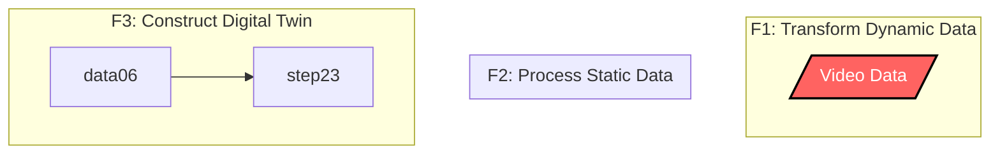

# Project Documentation

## Overview

**Objective**: The project *Automatic Pet Detection With Edge Computing* aims to develop an edge computing solution for the automatic detection of cats, dogs, golden hamster. Detailed requirements are listed [here](https://www.christianbaun.de/CGC23/index.html). General steps to achieve the project goal are:
- Set up a Sensor Node (Raspberry4) with Camera Modules
- Train a Model to Detect Pets
- Deploy the Trained Model on the Sensor Node
- Set up a Cluster of Raspberry3 Nodes
- Set up on the Cluster a Database for Storing Detection Results 
- Develop on the Cluster a WebApp for Displaying Detection Results
- Develop API Connection Between the Sensor Node, Cluster & WebApp
- Test Full System

**Duration**: 12.04.2023 - 05.07.2023

**Members**: 
- Vincent Roßknecht
- Jonas Hülsmann
- Ekrem Bugday
- Marco Tenderra
- Minh Kien Nguyen
- Alexander Atanassov

**Source Code**: [Link](https://github.com/ccfrauasgr2/pet-detection/tree/main)

**Presentation Slides**: [Link](https://docs.google.com/presentation/d/1wE96Q1euAeaRYBAPP1TrVFQCkrlQES2NmLTt2wVjyIs/edit?usp=sharing)

**System Architecture**:

**System Behavior**:

Sequence Diagram

**Project Plan**:

**Hardware**:

## Sensor Node

The following questions have to be answered:

- What is the general purpose of the component?
- Which tools/service/tech stacks were used and why?
- How were these used to achieve the general purpose?
- Example Results
- Known problems and improvement suggestions

## Cluster

The following questions have to be answered:

- What is the general purpose of the component?
- Which tools/service/tech stacks were used and why?
- How were these used to achieve the general purpose?
- Example Results
- Known problems and improvement suggestions

## Database

The following questions have to be answered:

- What is the general purpose of the component?
- Which tools/service/tech stacks were used and why?
- How were these used to achieve the general purpose?
- Example Results
- Known problems and improvement suggestions

## WebApp

The following questions have to be answered:

- What is the general purpose of the component?
- Which tools/service/tech stacks were used and why?
- How were these used to achieve the general purpose?
- Example Results
- Known problems and improvement suggestions

